# 📚 React Fundamentals - Câu Hỏi Phỏng Vấn

> **Tất cả examples được viết bằng TypeScript với chú thích tiếng Việt chi tiết**
> **Highlight các nội dung quan trọng để dễ hiểu và nhớ lâu**

## 🎯 **Mục Lục**

### **Phần 1: React Hooks Fundamentals**
- [Q1: useState Hook - Quản Lý State Cơ Bản](#q1-usestate-hook---quản-lý-state-cơ-bản)
- [Q2: useRef Hook - Tham Chiếu DOM & Mutable Values](#q2-useref-hook---tham-chiếu-dom--mutable-values)
- [Q3: useEffect Hook - Side Effects & Lifecycle](#q3-useeffect-hook---side-effects--lifecycle)
- [Q4: useLayoutEffect Hook - Synchronous Effects](#q4-uselayouteffect-hook---synchronous-effects)
- [Q5: useReducer Hook - Complex State Management](#q5-usereducer-hook---complex-state-management)
- [Q6: useContext Hook - Context API](#q6-usecontext-hook---context-api)
- [Q7: useImperativeHandle Hook - Imperative API](#q7-useimperativehandle-hook---imperative-api)

### **Phần 2: Component Lifecycle & Optimization**
- [Q8: Class Component Lifecycle - Vòng Đời Class Component](#q8-class-component-lifecycle---vòng-đời-class-component)
- [Q9: Functional Component Lifecycle - Vòng Đời Functional Component](#q9-functional-component-lifecycle---vòng-đời-functional-component)
- [Q10: PureComponent vs React.memo - Tối Ưu Re-render](#q10-purecomponent-vs-reactmemo---tối-ưu-re-render)
- [Q11: useMemo vs useCallback - Memoization Hooks](#q11-usememo-vs-usecallback---memoization-hooks)

### **Phần 3: Virtual DOM & Performance**
- [Q12: Virtual DOM - Cơ Chế Virtual DOM](#q12-virtual-dom---cơ-chế-virtual-dom)
- [Q13: Key Prop - Tối Ưu List Rendering](#q13-key-prop---tối-ưu-list-rendering)
- [Q14: React Batching - Batch Updates](#q14-react-batching---batch-updates)
- [Q15: Parent-Child Re-render - Tối Ưu Re-render](#q15-parent-child-re-render---tối-ưu-re-render)

### **Phần 4: State Management & Data Flow**
- [Q16: State vs Props - So Sánh State và Props](#q16-state-vs-props---so-sánh-state-và-props)
- [Q17: useRef vs useState - Khi Nào Dùng Gì](#q17-useref-vs-usestate---khi-nào-dùng-gì)
- [Q18: Context API vs Redux - State Management Solutions](#q18-context-api-vs-redux---state-management-solutions)
- [Q19: Redux/Zustand - Global State Management](#q19-reduxzustand---global-state-management)

### **Phần 5: Forms & User Input**
- [Q20: Controlled vs Uncontrolled Components](#q20-controlled-vs-uncontrolled-components)
- [Q21: React Hook Form - Form Management](#q21-react-hook-form---form-management)

### **Phần 6: Advanced Patterns**
- [Q22: HOC (Higher-Order Components)](#q22-hoc-higher-order-components)
- [Q23: Render Props Pattern](#q23-render-props-pattern)
- [Q24: Compound Components](#q24-compound-components)

### **Phần 7: Data Fetching & Async**
- [Q25: React Query - Server State Management](#q25-react-query---server-state-management)
- [Q26: useEffect Cleanup - Cleanup Functions](#q26-useeffect-cleanup---cleanup-functions)

### **Phần 8: Advanced React Features**
- [Q27: Code Splitting & Lazy Loading](#q27-code-splitting--lazy-loading)
- [Q28: React Reconciliation - Diffing Algorithm](#q28-react-reconciliation---diffing-algorithm)
- [Q29: React Router - Client-side Routing](#q29-react-router---client-side-routing)
- [Q30: React Portal - Render Outside DOM Tree](#q30-react-portal---render-outside-dom-tree)

### **Phần 9: React 18+ Features**
- [Q31: startTransition - Concurrent Features](#q31-starttransition---concurrent-features)
- [Q32: React Fragments - Grouping Elements](#q32-react-fragments---grouping-elements)
- [Q33: React IdleTime - Performance Monitoring](#q33-react-idletime---performance-monitoring)

### **Phần 10: Error Handling & Best Practices**
- [Q34: Error Boundaries - Error Handling](#q34-error-boundaries---error-handling)
- [Q35: Stable References - Reference Stability](#q35-stable-references---reference-stability)

---

## **Phần 1: React Hooks Fundamentals**

### **Q1: useState Hook - Quản Lý State Cơ Bản** 🔥

**Trả lời:**
- **🔥 useState**: Hook cơ bản nhất để quản lý state trong functional components
  - *Là gì*: Hook để tạo và quản lý state trong functional component
  - *Tại sao cần*: Functional component không có this.state như class component
  - *Khi nào dùng*: Khi cần lưu trữ và cập nhật dữ liệu trong component

- **🎯 Hoạt động**: Trả về array với 2 elements: [currentState, setterFunction]
  - *currentState*: Giá trị hiện tại của state
  - *setterFunction*: Hàm để cập nhật state
  - *Destructuring*: Thường dùng `const [state, setState] = useState(initialValue)`

- **⚡ Re-render**: Mỗi lần setState sẽ trigger re-render của component
  - *Cơ chế*: Khi state thay đổi → component re-render → UI cập nhật
  - *Lưu ý*: Chỉ re-render khi state thực sự thay đổi (shallow comparison)

- **✅ Ưu điểm**: Đơn giản, dễ sử dụng, type-safe với TypeScript
  - *Đơn giản*: Syntax ngắn gọn, dễ hiểu
  - *Type-safe*: TypeScript hỗ trợ type checking
  - *Predictable*: State updates có thể dự đoán được

- **⚠️ Nhược điểm**: Có thể gây unnecessary re-renders nếu không tối ưu
  - *Vấn đề*: Mỗi lần setState → toàn bộ component re-render
  - *Giải pháp*: Sử dụng React.memo, useMemo, useCallback

**Code Example:**
```typescript
import React, { useState } from 'react';

// 🔥 Basic useState usage - Cách sử dụng useState cơ bản
const Counter: React.FC = () => {
  // Khai báo state với TypeScript type annotation
  const [count, setCount] = useState<number>(0);        // State cho số đếm
  const [name, setName] = useState<string>('');         // State cho tên

  // Functional update - Cập nhật dựa trên giá trị cũ (an toàn hơn)
  const increment = () => {
    setCount(prevCount => prevCount + 1); // prevCount là giá trị hiện tại
  };

  // Direct update - Cập nhật trực tiếp (có thể gây race condition)
  const decrement = () => {
    setCount(count - 1); // Sử dụng giá trị count hiện tại
  };

  return (
    <div>
      <h2>Count: {count}</h2>
      <input
        value={name}                                    // Controlled input
        onChange={(e) => setName(e.target.value)}       // Cập nhật state khi user nhập
        placeholder="Enter name"
      />
      <button onClick={increment}>+</button>
      <button onClick={decrement}>-</button>
    </div>
  );
};

// 🎯 Complex state với object - State phức tạp với object
interface UserState {
  name: string;
  age: number;
  email: string;
}

const UserForm: React.FC = () => {
  // State object với initial values
  const [user, setUser] = useState<UserState>({
    name: '',      // Tên người dùng
    age: 0,        // Tuổi
    email: ''      // Email
  });

  // Hàm cập nhật một field cụ thể trong object
  const updateUser = (field: keyof UserState, value: string | number) => {
    setUser(prevUser => ({
      ...prevUser,    // Spread operator - giữ nguyên các field khác
      [field]: value  // Computed property - cập nhật field được chỉ định
    }));
  };

  return (
    <div>
      <input
        value={user.name}
        onChange={(e) => updateUser('name', e.target.value)}  // Cập nhật tên
        placeholder="Name"
      />
      <input
        value={user.age}
        onChange={(e) => updateUser('age', parseInt(e.target.value))}  // Cập nhật tuổi
        placeholder="Age"
        type="number"
      />
      <input
        value={user.email}
        onChange={(e) => updateUser('email', e.target.value)}  // Cập nhật email
        placeholder="Email"
      />
    </div>
  );
};

// ⚡ Lazy initial state - State khởi tạo chậm (lazy initialization)
const ExpensiveComponent: React.FC = () => {
  // Chỉ tính toán initial state một lần khi component mount
  const [data, setData] = useState(() => {
    console.log('Computing initial state...');  // Chỉ chạy một lần
    return expensiveCalculation();              // Tính toán phức tạp
  });

  return <div>{data}</div>;
};

// ✅ Multiple state variables - Nhiều state variables riêng biệt
const FormComponent: React.FC = () => {
  // Tách riêng từng state thay vì dùng một object lớn
  const [firstName, setFirstName] = useState('');    // Tên
  const [lastName, setLastName] = useState('');      // Họ
  const [email, setEmail] = useState('');            // Email

  // ✅ Tốt hơn: Tách riêng state variables
  // ❌ Tránh: const [form, setForm] = useState({ firstName: '', lastName: '', email: '' })
  // Lý do: Mỗi lần update một field → toàn bộ object re-render
};
```

**🎯 Best Practices - Thực Hành Tốt Nhất:**
- **✅ Sử dụng functional updates** khi state mới phụ thuộc vào state cũ
  - *Lý do*: Tránh race condition, đảm bảo state luôn đúng
  - *Ví dụ*: `setCount(prev => prev + 1)` thay vì `setCount(count + 1)`

- **✅ Tách state thành nhiều variables** thay vì một object lớn
  - *Lý do*: Tránh unnecessary re-renders, dễ maintain
  - *Ví dụ*: `const [name, setName] = useState('')` thay vì object

- **✅ Sử dụng lazy initial state** cho expensive calculations
  - *Lý do*: Chỉ tính toán một lần khi component mount
  - *Ví dụ*: `useState(() => expensiveCalculation())`

- **✅ Sử dụng TypeScript** để type-safe state
  - *Lý do*: Catch errors at compile time, better IDE support
  - *Ví dụ*: `useState<string>('')` thay vì `useState('')`

- **✅ Tránh setState trong render** để tránh infinite loops
  - *Lý do*: setState → re-render → setState → infinite loop
  - *Giải pháp*: Sử dụng useEffect hoặc event handlers

**❌ Common Mistakes - Lỗi Thường Gặp:**
```typescript
// ❌ Sai: Direct mutation - Thay đổi trực tiếp object
const [user, setUser] = useState({ name: 'John', age: 25 });
user.name = 'Jane'; // ❌ Không trigger re-render! React không detect được thay đổi

// ✅ Đúng: Immutable update - Cập nhật bất biến
setUser(prevUser => ({ ...prevUser, name: 'Jane' })); // ✅ Tạo object mới

// ❌ Sai: Unnecessary object wrapping - Bọc object không cần thiết
const [count, setCount] = useState({ value: 0 });     // ❌ Phức tạp không cần thiết
setCount({ value: count.value + 1 });                 // ❌ Khó đọc

// ✅ Đúng: Simple primitive state - State primitive đơn giản
const [count, setCount] = useState(0);                // ✅ Đơn giản, dễ hiểu
setCount(prev => prev + 1);                           // ✅ Functional update

// ❌ Sai: setState trong render - setState trong quá trình render
const BadComponent = () => {
  const [count, setCount] = useState(0);
  setCount(count + 1); // ❌ Infinite loop! setState → re-render → setState
  return <div>{count}</div>;
};

// ✅ Đúng: setState trong event handler hoặc useEffect
const GoodComponent = () => {
  const [count, setCount] = useState(0);

  const handleClick = () => {
    setCount(count + 1); // ✅ OK trong event handler
  };

  return <button onClick={handleClick}>Count: {count}</button>;
};
```

---

### **Q2: useRef Hook - Tham Chiếu DOM & Mutable Values** 🎯

**Trả lời:**
- **🔥 useRef**: Hook để tạo mutable reference không trigger re-render
  - *Là gì*: Hook tạo ra một object có property `.current` có thể thay đổi
  - *Đặc điểm*: Giá trị `.current` persist qua các lần re-render
  - *Khác useState*: Thay đổi `.current` không gây re-render

- **🎯 Mutable Values**: Lưu trữ values có thể thay đổi mà không gây re-render
  - *Use case*: Lưu trữ timer ID, previous values, DOM elements
  - *Lợi ích*: Không trigger re-render khi cần lưu trữ data tạm thời
  - *Ví dụ*: `const timerRef = useRef<NodeJS.Timeout>()`

- **⚡ DOM Access**: Truy cập trực tiếp DOM elements
  - *Cách dùng*: Gán ref vào JSX element: `<input ref={inputRef} />`
  - *Truy cập*: `inputRef.current.focus()` để focus input
  - *Lưu ý*: `.current` có thể null nên cần check: `inputRef.current?.focus()`

- **✅ Ưu điểm**: Không trigger re-render, persist values across renders
  - *Performance*: Không gây re-render khi thay đổi
  - *Persistence*: Giá trị được giữ nguyên qua các lần render
  - *Direct access*: Truy cập trực tiếp DOM elements

- **⚠️ Nhược điểm**: Thay đổi .current không trigger re-render
  - *Vấn đề*: UI không tự động update khi `.current` thay đổi
  - *Giải pháp*: Dùng useState nếu cần UI update
  - *Lưu ý*: Chỉ dùng cho values không ảnh hưởng đến UI

**Code Example:**
```typescript
import React, { useRef, useEffect, useState } from 'react';

// 🔥 DOM Reference - Tham chiếu DOM element
const FocusInput: React.FC = () => {
  // Tạo ref với TypeScript type cho HTMLInputElement
  const inputRef = useRef<HTMLInputElement>(null);

  const focusInput = () => {
    // Safe navigation - kiểm tra null trước khi gọi method
    inputRef.current?.focus(); // Chỉ focus nếu inputRef.current không null
  };

  return (
    <div>
      {/* Gán ref vào input element */}
      <input ref={inputRef} type="text" />
      <button onClick={focusInput}>Focus Input</button>
    </div>
  );
};

// 🎯 Mutable Values - Lưu trữ giá trị có thể thay đổi
const Timer: React.FC = () => {
  const [count, setCount] = useState(0);                    // State cho UI
  const intervalRef = useRef<NodeJS.Timeout | null>(null);  // Ref cho timer ID

  const startTimer = () => {
    if (intervalRef.current) return; // ✅ Prevent multiple intervals - tránh tạo nhiều timer

    // Lưu timer ID vào ref (không trigger re-render)
    intervalRef.current = setInterval(() => {
      setCount(prev => prev + 1);  // Cập nhật state để trigger re-render
    }, 1000);
  };

  const stopTimer = () => {
    if (intervalRef.current) {
      clearInterval(intervalRef.current);  // Dừng timer
      intervalRef.current = null;          // Reset ref
    }
  };

  // Cleanup khi component unmount
  useEffect(() => {
    return () => {
      if (intervalRef.current) {
        clearInterval(intervalRef.current);  // ✅ Cleanup để tránh memory leak
      }
    };
  }, []);

  return (
    <div>
      <h2>Count: {count}</h2>
      <button onClick={startTimer}>Start</button>
      <button onClick={stopTimer}>Stop</button>
    </div>
  );
};

// ⚡ Previous Value Tracking - Theo dõi giá trị trước đó
const PreviousValue: React.FC = () => {
  const [count, setCount] = useState(0);        // State hiện tại
  const prevCountRef = useRef<number>();        // Ref lưu giá trị trước đó

  // Chạy sau mỗi render để lưu giá trị hiện tại vào ref
  useEffect(() => {
    prevCountRef.current = count;  // Lưu giá trị hiện tại làm giá trị trước đó
  }); // Không có dependency array = chạy sau mỗi render

  const prevCount = prevCountRef.current;  // Lấy giá trị trước đó

  return (
    <div>
      <h2>Current: {count}</h2>      {/* Giá trị hiện tại */}
      <h2>Previous: {prevCount}</h2> {/* Giá trị trước đó */}
      <button onClick={() => setCount(count + 1)}>Increment</button>
    </div>
  );
};

// ✅ Imperative API
interface InputRef {
  focus: () => void;
  clear: () => void;
  getValue: () => string;
}

const CustomInput = React.forwardRef<InputRef, { placeholder: string }>(
  ({ placeholder }, ref) => {
    const inputRef = useRef<HTMLInputElement>(null);

    useImperativeHandle(ref, () => ({
      focus: () => inputRef.current?.focus(),
      clear: () => {
        if (inputRef.current) {
          inputRef.current.value = '';
        }
      },
      getValue: () => inputRef.current?.value || ''
    }));

    return <input ref={inputRef} placeholder={placeholder} />;
  }
);

// Usage
const ParentComponent: React.FC = () => {
  const inputRef = useRef<InputRef>(null);

  const handleFocus = () => {
    inputRef.current?.focus();
  };

  const handleClear = () => {
    inputRef.current?.clear();
  };

  return (
    <div>
      <CustomInput ref={inputRef} placeholder="Enter text" />
      <button onClick={handleFocus}>Focus</button>
      <button onClick={handleClear}>Clear</button>
    </div>
  );
};
```

**🎯 Best Practices - Thực Hành Tốt Nhất:**
- **✅ Sử dụng useRef cho DOM access** thay vì document.getElementById
  - *Lý do*: React-managed, type-safe, không cần query DOM
  - *Ví dụ*: `const inputRef = useRef<HTMLInputElement>(null)`

- **✅ Sử dụng useRef cho mutable values** không cần re-render
  - *Use case*: Timer IDs, previous values, cache data
  - *Lợi ích*: Không trigger re-render, persist across renders

- **✅ Cleanup refs trong useEffect** để tránh memory leaks
  - *Lý do*: Clear timers, subscriptions khi component unmount
  - *Ví dụ*: `return () => clearInterval(intervalRef.current)`

- **✅ Sử dụng TypeScript** để type-safe refs
  - *Lý do*: Catch errors at compile time, better IDE support
  - *Ví dụ*: `useRef<HTMLInputElement>(null)`

- **✅ Sử dụng useImperativeHandle** cho custom imperative APIs
  - *Use case*: Expose specific methods to parent components
  - *Lưu ý*: Use sparingly, prefer declarative patterns

**❌ Common Mistakes - Lỗi Thường Gặp:**
```typescript
// ❌ Sai: Mutating ref.current trong render - Thay đổi ref trong render
const BadComponent = () => {
  const countRef = useRef(0);
  countRef.current = countRef.current + 1; // ❌ Không trigger re-render
  return <div>{countRef.current}</div>;    // ❌ UI không update
};

// ✅ Đúng: Sử dụng useState cho values cần re-render
const GoodComponent = () => {
  const [count, setCount] = useState(0);   // ✅ Trigger re-render
  return <div>{count}</div>;               // ✅ UI update
};

// ❌ Sai: Không cleanup refs - Không dọn dẹp refs
const BadTimer = () => {
  const intervalRef = useRef<NodeJS.Timeout>();

  useEffect(() => {
    intervalRef.current = setInterval(() => {
      console.log('tick');
    }, 1000);
    // ❌ Missing cleanup! - Thiếu cleanup function
  }, []);

  return <div>Timer</div>;
};

// ✅ Đúng: Cleanup refs trong useEffect
const GoodTimer = () => {
  const intervalRef = useRef<NodeJS.Timeout>();

  useEffect(() => {
    intervalRef.current = setInterval(() => {
      console.log('tick');
    }, 1000);

    // ✅ Cleanup function - Dọn dẹp khi component unmount
    return () => {
      if (intervalRef.current) {
        clearInterval(intervalRef.current);
      }
    };
  }, []);

  return <div>Timer</div>;
};
```

---

### **Q3: useEffect Hook - Side Effects & Lifecycle** ⚡

**Trả lời:**
- **🔥 useEffect**: Hook để handle side effects trong functional components
  - *Là gì*: Hook để thực hiện side effects (API calls, subscriptions, DOM manipulation)
  - *Khi nào chạy*: Sau mỗi render (mặc định) hoặc theo dependency array
  - *Mục đích*: Thay thế lifecycle methods của class components

- **🎯 Lifecycle Coverage**: Thay thế componentDidMount, componentDidUpdate, componentWillUnmount
  - *componentDidMount*: `useEffect(() => {}, [])` - Empty dependency array
  - *componentDidUpdate*: `useEffect(() => {}, [dependency])` - Có dependencies
  - *componentWillUnmount*: `return () => {}` - Cleanup function

- **⚡ Dependencies**: Dependency array kiểm soát khi effect chạy
  - *Empty array []*: Chỉ chạy một lần sau mount
  - *Có dependencies*: Chạy khi dependencies thay đổi
  - *Không có array*: Chạy sau mỗi render

- **✅ Ưu điểm**: Declarative, dễ test, tránh memory leaks
  - *Declarative*: Mô tả "what" thay vì "when"
  - *Testable*: Dễ test hơn lifecycle methods
  - *Memory safe*: Cleanup function tránh memory leaks

- **⚠️ Nhược điểm**: Có thể gây infinite loops nếu dependencies không đúng
  - *Vấn đề*: Missing dependencies → stale closures
  - *Vấn đề*: Wrong dependencies → infinite loops
  - *Giải pháp*: Sử dụng ESLint plugin để check dependencies

**Code Example:**
```typescript
import React, { useEffect, useState } from 'react';

// 🔥 Basic useEffect - componentDidMount equivalent - Tương đương componentDidMount
const DataFetcher: React.FC = () => {
  const [data, setData] = useState(null);      // State cho data
  const [loading, setLoading] = useState(true); // State cho loading

  useEffect(() => {
    // Chạy sau mỗi render (componentDidMount + componentDidUpdate)
    console.log('Effect running...');

    // Fetch data từ API
    fetch('/api/data')
      .then(response => response.json())
      .then(data => {
        setData(data);        // Cập nhật data
        setLoading(false);    // Tắt loading
      });
  }, []); // ✅ Empty dependency array = chỉ chạy một lần sau mount

  if (loading) return <div>Loading...</div>;
  return <div>{JSON.stringify(data)}</div>;
};

// 🎯 useEffect với dependencies - Effect có dependencies
const UserProfile: React.FC<{ userId: string }> = ({ userId }) => {
  const [user, setUser] = useState(null);

  useEffect(() => {
    // Chạy khi userId thay đổi - componentDidUpdate equivalent
    fetch(`/api/users/${userId}`)
      .then(response => response.json())
      .then(setUser);
  }, [userId]); // ✅ Dependency array - effect chạy khi userId thay đổi

  return <div>{user?.name}</div>;
};

// ⚡ Cleanup function - componentWillUnmount equivalent - Tương đương componentWillUnmount
const Timer: React.FC = () => {
  const [count, setCount] = useState(0);

  useEffect(() => {
    // Tạo interval timer
    const interval = setInterval(() => {
      setCount(prev => prev + 1);  // Cập nhật count mỗi giây
    }, 1000);

    // ✅ Cleanup function - chạy trước khi component unmount
    return () => {
      clearInterval(interval);  // Dọn dẹp interval để tránh memory leak
    };
  }, []); // Empty dependency array - chỉ chạy một lần

  return <div>Count: {count}</div>;
};

// ✅ Multiple effects
const ComplexComponent: React.FC = () => {
  const [count, setCount] = useState(0);
  const [name, setName] = useState('');

  // Effect 1: Chỉ chạy khi count thay đổi
  useEffect(() => {
    document.title = `Count: ${count}`;
  }, [count]);

  // Effect 2: Chỉ chạy khi name thay đổi
  useEffect(() => {
    console.log(`Name changed to: ${name}`);
  }, [name]);

  // Effect 3: Chạy mỗi render
  useEffect(() => {
    console.log('Component rendered');
  }); // Không có dependency array

  return (
    <div>
      <input value={name} onChange={(e) => setName(e.target.value)} />
      <button onClick={() => setCount(count + 1)}>Count: {count}</button>
    </div>
  );
};

// 🔥 Custom hook với useEffect
const useApi = <T>(url: string): { data: T | null; loading: boolean; error: string | null } => {
  const [data, setData] = useState<T | null>(null);
  const [loading, setLoading] = useState(true);
  const [error, setError] = useState<string | null>(null);

  useEffect(() => {
    let cancelled = false;

    const fetchData = async () => {
      try {
        setLoading(true);
        setError(null);
        const response = await fetch(url);
        const result = await response.json();

        if (!cancelled) {
          setData(result);
        }
      } catch (err) {
        if (!cancelled) {
          setError(err instanceof Error ? err.message : 'An error occurred');
        }
      } finally {
        if (!cancelled) {
          setLoading(false);
        }
      }
    };

    fetchData();

    return () => {
      cancelled = true; // Cancel request if component unmounts
    };
  }, [url]);

  return { data, loading, error };
};
```

**🎯 Best Practices - Thực Hành Tốt Nhất:**
- **✅ Luôn cleanup subscriptions** để tránh memory leaks
  - *Lý do*: Tránh memory leaks, tránh gọi setState trên unmounted component
  - *Ví dụ*: `return () => subscription.unsubscribe()`

- **✅ Sử dụng dependency array** để kiểm soát khi effect chạy
  - *Empty array []*: Chỉ chạy một lần sau mount
  - *Có dependencies*: Chạy khi dependencies thay đổi
  - *Không có array*: Chạy sau mỗi render (thường không mong muốn)

- **✅ Tách effects riêng biệt** thay vì gộp nhiều logic
  - *Lý do*: Dễ đọc, dễ test, dễ maintain
  - *Ví dụ*: Tách effect cho API call và effect cho document title

- **✅ Sử dụng functional updates** trong setState
  - *Lý do*: Tránh stale closures, đảm bảo state luôn đúng
  - *Ví dụ*: `setCount(prev => prev + 1)` thay vì `setCount(count + 1)`

- **✅ Handle cleanup trong async operations**
  - *Lý do*: Tránh race conditions, tránh setState trên unmounted component
  - *Ví dụ*: Sử dụng AbortController hoặc cancelled flag

**❌ Common Mistakes - Lỗi Thường Gặp:**
```typescript
// ❌ Sai: Missing dependency array - Thiếu dependency array
useEffect(() => {
  fetchData(); // ❌ Chạy mỗi render! → Performance issue
});

// ✅ Đúng: Empty dependency array - Dependency array rỗng
useEffect(() => {
  fetchData(); // ✅ Chỉ chạy một lần sau mount
}, []);

// ❌ Sai: Missing dependencies - Thiếu dependencies
const [count, setCount] = useState(0);
useEffect(() => {
  document.title = `Count: ${count}`;
}, []); // ❌ Missing count dependency! → Stale closure

// ✅ Đúng: Include all dependencies - Bao gồm tất cả dependencies
useEffect(() => {
  document.title = `Count: ${count}`;
}, [count]); // ✅ Effect chạy khi count thay đổi

// ❌ Sai: Không cleanup - Không dọn dẹp
useEffect(() => {
  const subscription = subscribe();
  // ❌ Missing cleanup! → Memory leak
}, []);

// ✅ Đúng: Cleanup subscription - Dọn dẹp subscription
useEffect(() => {
  const subscription = subscribe();
  return () => subscription.unsubscribe(); // ✅ Cleanup function
}, []);

// ❌ Sai: Async operation không cleanup
useEffect(() => {
  let cancelled = false;

  const fetchData = async () => {
    const data = await api.getData();
    if (!cancelled) {  // ❌ Có thể setState trên unmounted component
      setData(data);
    }
  };

  fetchData();
  // ❌ Missing cleanup!
}, []);

// ✅ Đúng: Async operation với cleanup
useEffect(() => {
  let cancelled = false;

  const fetchData = async () => {
    const data = await api.getData();
    if (!cancelled) {  // ✅ Check cancelled flag
      setData(data);
    }
  };

  fetchData();

  return () => {
    cancelled = true;  // ✅ Set cancelled flag
  };
}, []);
```

---

### **Q4: useLayoutEffect Hook - Synchronous Effects** 🎯

**Trả lời:**
- **🔥 useLayoutEffect**: Chạy synchronously sau tất cả DOM mutations nhưng trước browser paint
  - *Là gì*: Hook tương tự useEffect nhưng chạy synchronously
  - *Timing*: Chạy sau DOM updates, trước browser paint
  - *Khác useEffect*: useEffect chạy asynchronously sau paint

- **🎯 Timing**: Chạy sau DOM updates, trước visual updates
  - *Thứ tự*: DOM mutations → useLayoutEffect → browser paint → useEffect
  - *Blocking*: Block browser paint cho đến khi effect hoàn thành
  - *Use case*: Khi cần đọc DOM hoặc thay đổi DOM trước khi user thấy

- **⚡ Use Cases**: DOM measurements, synchronous DOM mutations
  - *DOM measurements*: Đo kích thước, vị trí elements
  - *Synchronous updates*: Thay đổi DOM trước khi paint
  - *Animation setup*: Thiết lập animation states

- **✅ Ưu điểm**: Tránh visual flicker, chính xác cho DOM measurements
  - *No flicker*: Không có hiện tượng nhấp nháy
  - *Accurate measurements*: Đo DOM chính xác sau khi update
  - *Synchronous*: Đảm bảo thứ tự thực hiện

- **⚠️ Nhược điểm**: Blocking, có thể gây performance issues
  - *Blocking*: Block browser paint, có thể gây lag
  - *Performance*: Chậm hơn useEffect
  - *Lưu ý*: Chỉ dùng khi thực sự cần thiết

**Code Example:**
```typescript
import React, { useLayoutEffect, useRef, useState } from 'react';

// 🔥 DOM Measurements - Đo kích thước DOM elements
const MeasuredComponent: React.FC = () => {
  const [dimensions, setDimensions] = useState({ width: 0, height: 0 }); // State cho kích thước
  const ref = useRef<HTMLDivElement>(null); // Ref để truy cập DOM element

  useLayoutEffect(() => {
    if (ref.current) {
      // Đo kích thước element sau khi DOM đã update
      const { width, height } = ref.current.getBoundingClientRect();
      setDimensions({ width, height }); // Cập nhật state
    }
  }, []); // Chỉ chạy một lần sau mount

  return (
    <div ref={ref}>
      <p>Width: {dimensions.width}px</p>   {/* Hiển thị chiều rộng */}
      <p>Height: {dimensions.height}px</p> {/* Hiển thị chiều cao */}
    </div>
  );
};

// 🎯 Synchronous DOM Updates
const ScrollToTop: React.FC = () => {
  const [showButton, setShowButton] = useState(false);
  const buttonRef = useRef<HTMLButtonElement>(null);

  useLayoutEffect(() => {
    if (showButton && buttonRef.current) {
      // Synchronous scroll - no flicker
      buttonRef.current.scrollIntoView({ behavior: 'smooth' });
    }
  }, [showButton]);

  return (
    <div>
      <button onClick={() => setShowButton(!showButton)}>
        Toggle Button
      </button>
      {showButton && (
        <button ref={buttonRef}>
          Scroll to Top
        </button>
      )}
    </div>
  );
};

// ⚡ Animation Setup
const AnimatedComponent: React.FC = () => {
  const [isVisible, setIsVisible] = useState(false);
  const elementRef = useRef<HTMLDivElement>(null);

  useLayoutEffect(() => {
    if (elementRef.current) {
      // Set initial state before paint
      elementRef.current.style.transform = 'translateX(-100%)';
      elementRef.current.style.transition = 'transform 0.3s ease';

      // Trigger animation after layout
      requestAnimationFrame(() => {
        if (elementRef.current) {
          elementRef.current.style.transform = 'translateX(0)';
        }
      });
    }
  }, [isVisible]);

  return (
    <div>
      <button onClick={() => setIsVisible(!isVisible)}>
        Toggle Animation
      </button>
      {isVisible && (
        <div ref={elementRef} style={{ width: '200px', height: '100px', background: 'blue' }}>
          Animated Element
        </div>
      )}
    </div>
  );
};
```

**🎯 Best Practices - Thực Hành Tốt Nhất:**
- **✅ Sử dụng cho DOM measurements** trước khi browser paint
  - *Lý do*: Đảm bảo đo được kích thước chính xác sau DOM update
  - *Ví dụ*: Đo kích thước element để tính toán layout

- **✅ Sử dụng cho synchronous DOM updates** để tránh flicker
  - *Lý do*: Thay đổi DOM trước khi user thấy, tránh nhấp nháy
  - *Ví dụ*: Scroll to element, thay đổi position

- **✅ Kết hợp với requestAnimationFrame** cho smooth animations
  - *Lý do*: Đảm bảo animation chạy mượt mà
  - *Ví dụ*: Setup animation state trong useLayoutEffect, trigger trong RAF

- **✅ Tránh heavy computations** vì nó blocking
  - *Lý do*: Block browser paint, gây lag cho user
  - *Giải pháp*: Dùng useEffect cho heavy computations

- **✅ Prefer useEffect** cho hầu hết use cases
  - *Lý do*: useEffect không blocking, performance tốt hơn
  - *Chỉ dùng useLayoutEffect*: Khi thực sự cần synchronous updates

---

### **Q5: useReducer Hook - Complex State Management** 🔥

**Trả lời:**
- **🔥 useReducer**: Hook cho complex state logic với multiple sub-values
  - *Là gì*: Hook quản lý state phức tạp với reducer pattern
  - *Khi nào dùng*: State có nhiều sub-values, logic phức tạp
  - *Khác useState*: Tốt hơn cho state phức tạp, nhiều actions

- **🎯 Reducer Pattern**: (state, action) => newState
  - *Pure function*: Reducer là pure function, không side effects
  - *Predictable*: Cùng state + action = cùng newState
  - *Immutable*: Luôn return new state, không mutate

- **⚡ Use Cases**: Complex state logic, multiple related state values
  - *Form state*: Nhiều fields, validation, errors
  - *Todo app*: Todos, filters, loading states
  - *Shopping cart*: Items, quantities, totals

- **✅ Ưu điểm**: Predictable state updates, easier testing, better for complex logic
  - *Predictable*: State updates có thể dự đoán được
  - *Testable*: Dễ test reducer functions
  - *Scalable*: Dễ mở rộng cho complex logic

- **⚠️ Nhược điểm**: More boilerplate than useState
  - *Boilerplate*: Cần viết nhiều code hơn useState
  - *Learning curve*: Khó hiểu hơn cho beginners
  - *Overkill*: Không cần thiết cho simple state

**Code Example:**
```typescript
import React, { useReducer } from 'react';

// 🔥 Basic useReducer - useReducer cơ bản
interface CounterState {
  count: number; // State chỉ có một field count
}

// Union type cho các actions có thể dispatch
type CounterAction =
  | { type: 'increment' }           // Action tăng count
  | { type: 'decrement' }           // Action giảm count
  | { type: 'reset' }               // Action reset về 0
  | { type: 'set'; payload: number }; // Action set giá trị cụ thể

// Reducer function - pure function nhận state và action, return newState
const counterReducer = (state: CounterState, action: CounterAction): CounterState => {
  switch (action.type) {
    case 'increment':
      return { count: state.count + 1 }; // ✅ Immutable update
    case 'decrement':
      return { count: state.count - 1 }; // ✅ Immutable update
    case 'reset':
      return { count: 0 };               // ✅ Reset về 0
    case 'set':
      return { count: action.payload };  // ✅ Set giá trị từ payload
    default:
      return state; // ✅ Return state hiện tại nếu không match action nào
  }
};

const Counter: React.FC = () => {
  // useReducer nhận reducer function và initial state
  const [state, dispatch] = useReducer(counterReducer, { count: 0 });

  return (
    <div>
      <h2>Count: {state.count}</h2>
      {/* Dispatch các actions khác nhau */}
      <button onClick={() => dispatch({ type: 'increment' })}>+</button>
      <button onClick={() => dispatch({ type: 'decrement' })}>-</button>
      <button onClick={() => dispatch({ type: 'reset' })}>Reset</button>
      <button onClick={() => dispatch({ type: 'set', payload: 10 })}>Set to 10</button>
    </div>
  );
};

// 🎯 Complex State Management
interface Todo {
  id: string;
  text: string;
  completed: boolean;
}

interface TodoState {
  todos: Todo[];
  filter: 'all' | 'active' | 'completed';
}

type TodoAction =
  | { type: 'ADD_TODO'; payload: string }
  | { type: 'TOGGLE_TODO'; payload: string }
  | { type: 'DELETE_TODO'; payload: string }
  | { type: 'SET_FILTER'; payload: 'all' | 'active' | 'completed' }
  | { type: 'CLEAR_COMPLETED' };

const todoReducer = (state: TodoState, action: TodoAction): TodoState => {
  switch (action.type) {
    case 'ADD_TODO':
      return {
        ...state,
        todos: [
          ...state.todos,
          {
            id: Date.now().toString(),
            text: action.payload,
            completed: false
          }
        ]
      };
    case 'TOGGLE_TODO':
      return {
        ...state,
        todos: state.todos.map(todo =>
          todo.id === action.payload
            ? { ...todo, completed: !todo.completed }
            : todo
        )
      };
    case 'DELETE_TODO':
      return {
        ...state,
        todos: state.todos.filter(todo => todo.id !== action.payload)
      };
    case 'SET_FILTER':
      return { ...state, filter: action.payload };
    case 'CLEAR_COMPLETED':
      return {
        ...state,
        todos: state.todos.filter(todo => !todo.completed)
      };
    default:
      return state;
  }
};

const TodoApp: React.FC = () => {
  const [state, dispatch] = useReducer(todoReducer, {
    todos: [],
    filter: 'all'
  });

  const filteredTodos = state.todos.filter(todo => {
    switch (state.filter) {
      case 'active':
        return !todo.completed;
      case 'completed':
        return todo.completed;
      default:
        return true;
    }
  });

  return (
    <div>
      <input
        onKeyPress={(e) => {
          if (e.key === 'Enter') {
            dispatch({ type: 'ADD_TODO', payload: e.currentTarget.value });
            e.currentTarget.value = '';
          }
        }}
        placeholder="Add todo"
      />
      <div>
        {['all', 'active', 'completed'].map(filter => (
          <button
            key={filter}
            onClick={() => dispatch({ type: 'SET_FILTER', payload: filter as any })}
            style={{ fontWeight: state.filter === filter ? 'bold' : 'normal' }}
          >
            {filter}
          </button>
        ))}
      </div>
      <ul>
        {filteredTodos.map(todo => (
          <li key={todo.id}>
            <input
              type="checkbox"
              checked={todo.completed}
              onChange={() => dispatch({ type: 'TOGGLE_TODO', payload: todo.id })}
            />
            <span style={{ textDecoration: todo.completed ? 'line-through' : 'none' }}>
              {todo.text}
            </span>
            <button onClick={() => dispatch({ type: 'DELETE_TODO', payload: todo.id })}>
              Delete
            </button>
          </li>
        ))}
      </ul>
    </div>
  );
};
```

**🎯 Best Practices - Thực Hành Tốt Nhất:**
- **✅ Sử dụng cho complex state logic** với multiple related values
  - *Khi nào*: State có nhiều fields liên quan, logic phức tạp
  - *Ví dụ*: Form với validation, todo app với filters
  - *Lợi ích*: Dễ quản lý, test, và maintain

- **✅ Define clear action types** với TypeScript
  - *Lý do*: Type safety, better IDE support, catch errors at compile time
  - *Ví dụ*: `type Action = { type: 'ADD_TODO'; payload: string }`
  - *Lưu ý*: Sử dụng union types cho multiple actions

- **✅ Keep reducers pure** - no side effects
  - *Pure function*: Không mutate state, không side effects
  - *Predictable*: Cùng input → cùng output
  - *Testable*: Dễ test vì không phụ thuộc external state

- **✅ Use with useContext** cho global state management
  - *Pattern*: Context + useReducer = Redux-like state management
  - *Lợi ích*: Tránh prop drilling, centralized state
  - *Ví dụ*: User authentication, theme management

- **✅ Extract complex logic** vào separate reducer functions
  - *Lý do*: Dễ test, reuse, và maintain
  - *Ví dụ*: Tách reducer cho todos, users, filters
  - *Combine*: Sử dụng combineReducers pattern

---

### **Q6: useContext Hook - Context API** 🎯

**Trả lời:**
- **🔥 useContext**: Hook để consume React Context
  - *Là gì*: Hook để đọc giá trị từ React Context
  - *Cách dùng*: `const value = useContext(MyContext)`
  - *Khi nào*: Khi cần access context value trong functional component

- **🎯 Purpose**: Tránh prop drilling, share data across component tree
  - *Prop drilling*: Truyền props qua nhiều levels không cần thiết
  - *Context*: Share data trực tiếp đến bất kỳ component nào
  - *Tree-wide*: Data có thể access từ bất kỳ đâu trong component tree

- **⚡ Use Cases**: Theme, authentication, language settings
  - *Theme*: Dark/light mode, colors, fonts
  - *Authentication*: User info, login status, permissions
  - *Language*: i18n, translations, locale settings
  - *Global state*: Shopping cart, notifications, modals

- **✅ Ưu điểm**: Tránh prop drilling, clean component APIs
  - *No prop drilling*: Không cần truyền props qua nhiều levels
  - *Clean APIs*: Component APIs sạch hơn, ít props hơn
  - *Flexible*: Dễ thêm/bớt consumers

- **⚠️ Nhược điểm**: Có thể gây unnecessary re-renders
  - *Re-render issue*: Tất cả consumers re-render khi context value thay đổi
  - *Performance*: Có thể gây performance issues với large trees
  - *Giải pháp*: Memoize context value, split contexts

**Code Example:**
```typescript
import React, { createContext, useContext, useState, ReactNode } from 'react';

// 🔥 Basic Context - Context cơ bản
interface ThemeContextType {
  theme: 'light' | 'dark';    // Theme hiện tại
  toggleTheme: () => void;    // Function để toggle theme
}

// Tạo context với TypeScript type
const ThemeContext = createContext<ThemeContextType | undefined>(undefined);

// Provider component - Cung cấp context value
const ThemeProvider: React.FC<{ children: ReactNode }> = ({ children }) => {
  const [theme, setTheme] = useState<'light' | 'dark'>('light'); // State cho theme

  const toggleTheme = () => {
    setTheme(prev => prev === 'light' ? 'dark' : 'light'); // Toggle theme
  };

  return (
    <ThemeContext.Provider value={{ theme, toggleTheme }}>
      {children}
    </ThemeContext.Provider>
  );
};

// Custom hook để consume context - Tránh lỗi khi dùng ngoài Provider
const useTheme = () => {
  const context = useContext(ThemeContext);
  if (context === undefined) {
    throw new Error('useTheme must be used within a ThemeProvider');
  }
  return context;
};

// Component sử dụng context
const ThemedButton: React.FC = () => {
  const { theme, toggleTheme } = useTheme(); // Consume context

  return (
    <button
      onClick={toggleTheme}
      style={{
        backgroundColor: theme === 'light' ? '#fff' : '#333', // Dynamic styling
        color: theme === 'light' ? '#333' : '#fff'
      }}
    >
      Current theme: {theme}
    </button>
  );
};

// 🎯 Context + useReducer Pattern
interface User {
  id: string;
  name: string;
  email: string;
}

interface AppState {
  user: User | null;
  loading: boolean;
  error: string | null;
}

type AppAction =
  | { type: 'SET_LOADING'; payload: boolean }
  | { type: 'SET_USER'; payload: User }
  | { type: 'SET_ERROR'; payload: string }
  | { type: 'LOGOUT' };

const appReducer = (state: AppState, action: AppAction): AppState => {
  switch (action.type) {
    case 'SET_LOADING':
      return { ...state, loading: action.payload };
    case 'SET_USER':
      return { ...state, user: action.payload, loading: false, error: null };
    case 'SET_ERROR':
      return { ...state, error: action.payload, loading: false };
    case 'LOGOUT':
      return { ...state, user: null, error: null };
    default:
      return state;
  }
};

const AppContext = createContext<{
  state: AppState;
  dispatch: React.Dispatch<AppAction>;
} | undefined>(undefined);

const AppProvider: React.FC<{ children: ReactNode }> = ({ children }) => {
  const [state, dispatch] = useReducer(appReducer, {
    user: null,
    loading: false,
    error: null
  });

  return (
    <AppContext.Provider value={{ state, dispatch }}>
      {children}
    </AppContext.Provider>
  );
};

const useApp = () => {
  const context = useContext(AppContext);
  if (context === undefined) {
    throw new Error('useApp must be used within an AppProvider');
  }
  return context;
};
```

**🎯 Best Practices - Thực Hành Tốt Nhất:**
- **✅ Tạo custom hook** để consume context
  - *Lý do*: Encapsulate context logic, error handling
  - *Ví dụ*: `const useTheme = () => { ... }`
  - *Lợi ích*: Reusable, type-safe, error handling

- **✅ Validate context** trong custom hook
  - *Lý do*: Tránh lỗi khi dùng context ngoài Provider
  - *Ví dụ*: `if (context === undefined) throw new Error(...)`
  - *Lợi ích*: Clear error messages, better debugging

- **✅ Split contexts** theo domain (theme, auth, etc.)
  - *Lý do*: Tránh unnecessary re-renders, better performance
  - *Ví dụ*: ThemeContext, AuthContext, UserContext
  - *Lợi ích*: Components chỉ re-render khi cần thiết

- **✅ Use with useReducer** cho complex state
  - *Pattern*: Context + useReducer = Redux-like state management
  - *Lợi ích*: Predictable state updates, better testing
  - *Ví dụ*: Global app state, form state management

- **✅ Memoize context value** để tránh unnecessary re-renders
  - *Vấn đề*: Object/function mới mỗi render → tất cả consumers re-render
  - *Giải pháp*: `useMemo` cho context value
  - *Ví dụ*: `const value = useMemo(() => ({ theme, toggleTheme }), [theme])`

---

### **Q7: useImperativeHandle Hook - Imperative API** ⚡

**Trả lời:**
- **🔥 useImperativeHandle**: Customize instance value được expose qua ref
  - *Là gì*: Hook để customize ref value được expose ra ngoài
  - *Cách dùng*: `useImperativeHandle(ref, () => ({ ... }), [deps])`
  - *Khi nào*: Khi cần expose specific methods cho parent component

- **🎯 Purpose**: Tạo imperative API cho functional components
  - *Imperative*: Gọi methods trực tiếp thay vì declarative
  - *API*: Expose specific methods, hide internal implementation
  - *Control*: Parent component có thể control child component

- **⚡ Use Cases**: Focus management, scroll control, animation triggers
  - *Focus*: Focus input, textarea, button
  - *Scroll*: Scroll to element, scroll to top
  - *Animation*: Start/stop animations, trigger effects
  - *Form validation*: Validate form, reset form

- **✅ Ưu điểm**: Expose specific methods, hide internal implementation
  - *Specific API*: Chỉ expose những methods cần thiết
  - *Encapsulation*: Hide internal state và implementation
  - *Control*: Parent có thể control child behavior

- **⚠️ Nhược điểm**: Breaks declarative paradigm, use sparingly
  - *Paradigm*: React là declarative, useImperativeHandle là imperative
  - *Sparingly*: Chỉ dùng khi thực sự cần thiết
  - *Alternative*: Prefer declarative patterns khi có thể

**Code Example:**
```typescript
import React, { useImperativeHandle, useRef, forwardRef } from 'react';

// 🔥 Basic useImperativeHandle - useImperativeHandle cơ bản
interface InputRef {
  focus: () => void;      // Method để focus input
  clear: () => void;      // Method để clear input
  getValue: () => string; // Method để lấy giá trị input
}

const CustomInput = forwardRef<InputRef, { placeholder: string }>(
  ({ placeholder }, ref) => {
    const inputRef = useRef<HTMLInputElement>(null); // Ref cho actual input

    // Customize ref value được expose ra ngoài
    useImperativeHandle(ref, () => ({
      focus: () => {
        inputRef.current?.focus(); // Focus input element
      },
      clear: () => {
        if (inputRef.current) {
          inputRef.current.value = ''; // Clear input value
        }
      },
      getValue: () => {
        return inputRef.current?.value || ''; // Get input value
      }
    }));

    return <input ref={inputRef} placeholder={placeholder} />;
  }
);

// 🎯 Modal with imperative API
interface ModalRef {
  open: () => void;
  close: () => void;
  toggle: () => void;
}

const Modal = forwardRef<ModalRef, { children: React.ReactNode }>(
  ({ children }, ref) => {
    const [isOpen, setIsOpen] = useState(false);

    useImperativeHandle(ref, () => ({
      open: () => setIsOpen(true),
      close: () => setIsOpen(false),
      toggle: () => setIsOpen(prev => !prev)
    }));

    if (!isOpen) return null;

    return (
      <div className="modal-overlay">
        <div className="modal-content">
          {children}
        </div>
      </div>
    );
  }
);

// ⚡ Form with validation
interface FormRef {
  validate: () => boolean;
  reset: () => void;
  getValues: () => Record<string, string>;
}

const CustomForm = forwardRef<FormRef, { onSubmit: (values: Record<string, string>) => void }>(
  ({ onSubmit }, ref) => {
    const [values, setValues] = useState<Record<string, string>>({});
    const [errors, setErrors] = useState<Record<string, string>>({});

    useImperativeHandle(ref, () => ({
      validate: () => {
        const newErrors: Record<string, string> = {};

        if (!values.email) {
          newErrors.email = 'Email is required';
        }
        if (!values.password) {
          newErrors.password = 'Password is required';
        }

        setErrors(newErrors);
        return Object.keys(newErrors).length === 0;
      },
      reset: () => {
        setValues({});
        setErrors({});
      },
      getValues: () => values
    }));

    const handleSubmit = (e: React.FormEvent) => {
      e.preventDefault();
      onSubmit(values);
    };

    return (
      <form onSubmit={handleSubmit}>
        <input
          value={values.email || ''}
          onChange={(e) => setValues(prev => ({ ...prev, email: e.target.value }))}
          placeholder="Email"
        />
        {errors.email && <span className="error">{errors.email}</span>}

        <input
          type="password"
          value={values.password || ''}
          onChange={(e) => setValues(prev => ({ ...prev, password: e.target.value }))}
          placeholder="Password"
        />
        {errors.password && <span className="error">{errors.password}</span>}

        <button type="submit">Submit</button>
      </form>
    );
  }
);

// Usage
const ParentComponent: React.FC = () => {
  const inputRef = useRef<InputRef>(null);
  const modalRef = useRef<ModalRef>(null);
  const formRef = useRef<FormRef>(null);

  const handleFocusInput = () => {
    inputRef.current?.focus();
  };

  const handleOpenModal = () => {
    modalRef.current?.open();
  };

  const handleValidateForm = () => {
    const isValid = formRef.current?.validate();
    if (isValid) {
      const values = formRef.current?.getValues();
      console.log('Form values:', values);
    }
  };

  return (
    <div>
      <CustomInput ref={inputRef} placeholder="Enter text" />
      <button onClick={handleFocusInput}>Focus Input</button>

      <button onClick={handleOpenModal}>Open Modal</button>
      <Modal ref={modalRef}>
        <h2>Modal Content</h2>
        <button onClick={() => modalRef.current?.close()}>Close</button>
      </Modal>

      <CustomForm ref={formRef} onSubmit={(values) => console.log(values)} />
      <button onClick={handleValidateForm}>Validate Form</button>
    </div>
  );
};
```

**🎯 Best Practices - Thực Hành Tốt Nhất:**
- **✅ Sử dụng sparingly** - prefer declarative patterns
  - *Lý do*: React là declarative, useImperativeHandle là imperative
  - *Alternative*: Sử dụng props, state, callbacks khi có thể
  - *Khi nào*: Chỉ khi thực sự cần imperative control

- **✅ Expose minimal API** - chỉ những methods cần thiết
  - *Lý do*: Giảm coupling, dễ maintain, tránh expose internal details
  - *Ví dụ*: Chỉ expose `focus()`, `clear()` thay vì toàn bộ DOM API
  - *Lợi ích*: Clean API, better encapsulation

- **✅ Combine với forwardRef** để expose ref
  - *Lý do*: forwardRef cho phép parent access ref của child
  - *Pattern*: `forwardRef` + `useImperativeHandle`
  - *Ví dụ*: `const Component = forwardRef<RefType, PropsType>((props, ref) => { ... })`

- **✅ Use for focus management** và scroll control
  - *Focus*: Focus input, textarea, button
  - *Scroll*: Scroll to element, scroll to top
  - *Animation*: Start/stop animations, trigger effects
  - *Form*: Validate form, reset form

- **✅ Document imperative API** clearly
  - *Lý do*: Imperative API khó hiểu hơn declarative
  - *Documentation*: Mô tả rõ methods, parameters, return values
  - *Examples*: Cung cấp examples sử dụng

---

## **Phần 2: Component Lifecycle & Optimization**

### **Q8: Class Component Lifecycle - Vòng Đời Class Component** 🔥

**Trả lời:**
- **🔥 Class Lifecycle**: Các methods được gọi trong vòng đời của class component
  - *Là gì*: Các lifecycle methods được React gọi tự động
  - *Khi nào*: Tại các thời điểm khác nhau trong vòng đời component
  - *Mục đích*: Thực hiện side effects, cleanup, optimization

- **🎯 Mounting**: componentDidMount - chạy sau khi component được mount
  - *Khi nào*: Sau khi component được render lần đầu tiên
  - *Use case*: API calls, setup subscriptions, DOM manipulation
  - *Tương đương*: `useEffect(() => {}, [])` trong functional component

- **⚡ Updating**: componentDidUpdate - chạy sau khi component update
  - *Khi nào*: Sau khi component re-render do props/state thay đổi
  - *Use case*: Update DOM, API calls dựa trên props mới
  - *Tương đương*: `useEffect(() => {}, [dependencies])` trong functional component

- **✅ Unmounting**: componentWillUnmount - chạy trước khi component unmount
  - *Khi nào*: Trước khi component bị remove khỏi DOM
  - *Use case*: Cleanup subscriptions, timers, event listeners
  - *Tương đương*: Cleanup function trong `useEffect`

- **⚠️ Lưu ý**: Class components đã deprecated, prefer functional components
  - *Deprecated*: React team khuyến khích dùng functional components
  - *Lý do*: Hooks dễ hiểu, test, và maintain hơn
  - *Migration*: Chuyển đổi từ class sang functional components

**Code Example:**
```typescript
import React, { Component } from 'react';

// 🔥 Class Component Lifecycle - Vòng đời class component
class UserProfile extends Component<{ userId: string }, { user: any; loading: boolean }> {
  constructor(props: { userId: string }) {
    super(props);
    this.state = {
      user: null,
      loading: true
    };
  }

  // 🎯 componentDidMount - Chạy sau khi component mount
  componentDidMount() {
    console.log('Component mounted'); // Chạy một lần sau mount
    this.fetchUser(); // Fetch data từ API
  }

  // ⚡ componentDidUpdate - Chạy sau khi component update
  componentDidUpdate(prevProps: { userId: string }) {
    // Chỉ fetch khi userId thay đổi
    if (prevProps.userId !== this.props.userId) {
      this.fetchUser();
    }
  }

  // ✅ componentWillUnmount - Chạy trước khi component unmount
  componentWillUnmount() {
    console.log('Component will unmount');
    // Cleanup subscriptions, timers
    if (this.timer) {
      clearInterval(this.timer);
    }
  }

  private timer?: NodeJS.Timeout;

  fetchUser = async () => {
    try {
      this.setState({ loading: true });
      const response = await fetch(`/api/users/${this.props.userId}`);
      const user = await response.json();
      this.setState({ user, loading: false });
    } catch (error) {
      this.setState({ loading: false });
    }
  };

  render() {
    const { user, loading } = this.state;

    if (loading) return <div>Loading...</div>;
    return <div>{user?.name}</div>;
  }
}
```

**🎯 Best Practices - Thực Hành Tốt Nhất:**
- **✅ Sử dụng functional components** với hooks thay vì class components
  - *Lý do*: Hooks dễ hiểu, test, và maintain hơn
  - *Migration*: Chuyển đổi từ class sang functional components
  - *Lợi ích*: Ít boilerplate, better performance

- **✅ Hiểu lifecycle mapping** từ class sang functional
  - *componentDidMount*: `useEffect(() => {}, [])`
  - *componentDidUpdate*: `useEffect(() => {}, [dependencies])`
  - *componentWillUnmount*: Cleanup function trong `useEffect`

- **✅ Cleanup trong componentWillUnmount**
  - *Lý do*: Tránh memory leaks, tránh setState trên unmounted component
  - *Ví dụ*: Clear timers, unsubscribe, remove event listeners
  - *Quan trọng*: Luôn cleanup resources

---

### **Q9: Functional Component Lifecycle - Vòng Đời Functional Component** ⚡

**Trả lời:**
- **🔥 Functional Lifecycle**: Sử dụng hooks để handle lifecycle trong functional components
  - *Là gì*: useEffect hook thay thế lifecycle methods của class components
  - *Cách hoạt động*: Dependency array kiểm soát khi effect chạy
  - *Ưu điểm*: Declarative, dễ test, tránh memory leaks

- **🎯 Mounting**: useEffect với empty dependency array
  - *Khi nào*: Chỉ chạy một lần sau khi component mount
  - *Tương đương*: componentDidMount
  - *Ví dụ*: `useEffect(() => { fetchData(); }, [])`

- **⚡ Updating**: useEffect với dependencies
  - *Khi nào*: Chạy khi dependencies thay đổi
  - *Tương đương*: componentDidUpdate
  - *Ví dụ*: `useEffect(() => { fetchUser(userId); }, [userId])`

- **✅ Unmounting**: Cleanup function trong useEffect
  - *Khi nào*: Chạy trước khi component unmount hoặc trước effect tiếp theo
  - *Tương đương*: componentWillUnmount
  - *Ví dụ*: `return () => { clearInterval(timer); }`

- **⚠️ Lưu ý**: useEffect có thể chạy nhiều lần, cần cẩn thận với dependencies
  - *Dependencies*: Phải include tất cả values được sử dụng trong effect
  - *Stale closures*: Missing dependencies có thể gây stale closures
  - *Infinite loops*: Wrong dependencies có thể gây infinite loops

**Code Example:**
```typescript
import React, { useEffect, useState } from 'react';

// 🔥 Functional Component Lifecycle - Vòng đời functional component
const UserProfile: React.FC<{ userId: string }> = ({ userId }) => {
  const [user, setUser] = useState<any>(null);
  const [loading, setLoading] = useState(true);

  // 🎯 Mounting - componentDidMount equivalent
  useEffect(() => {
    console.log('Component mounted'); // Chạy một lần sau mount
    fetchUser(); // Fetch data từ API
  }, []); // Empty dependency array = chỉ chạy một lần

  // ⚡ Updating - componentDidUpdate equivalent
  useEffect(() => {
    if (userId) {
      fetchUser(); // Fetch khi userId thay đổi
    }
  }, [userId]); // Dependency array = chạy khi userId thay đổi

  // ✅ Unmounting - componentWillUnmount equivalent
  useEffect(() => {
    const timer = setInterval(() => {
      console.log('Timer tick');
    }, 1000);

    // Cleanup function - chạy trước khi unmount
    return () => {
      console.log('Component will unmount');
      clearInterval(timer); // Cleanup timer
    };
  }, []);

  const fetchUser = async () => {
    try {
      setLoading(true);
      const response = await fetch(`/api/users/${userId}`);
      const userData = await response.json();
      setUser(userData);
    } catch (error) {
      console.error('Error fetching user:', error);
    } finally {
      setLoading(false);
    }
  };

  if (loading) return <div>Loading...</div>;
  return <div>{user?.name}</div>;
};
```

**🎯 Best Practices - Thực Hành Tốt Nhất:**
- **✅ Sử dụng dependency array** để kiểm soát khi effect chạy
  - *Empty array []*: Chỉ chạy một lần sau mount
  - *Có dependencies*: Chạy khi dependencies thay đổi
  - *Không có array*: Chạy sau mỗi render (thường không mong muốn)

- **✅ Luôn cleanup subscriptions** trong useEffect
  - *Lý do*: Tránh memory leaks, tránh setState trên unmounted component
  - *Ví dụ*: Clear timers, unsubscribe, remove event listeners
  - *Pattern*: `return () => { cleanup(); }`

- **✅ Tách effects riêng biệt** thay vì gộp nhiều logic
  - *Lý do*: Dễ đọc, dễ test, dễ maintain
  - *Ví dụ*: Tách effect cho API call và effect cho document title
  - *Lợi ích*: Mỗi effect có responsibility riêng

---

### **Q10: PureComponent vs React.memo - Tối Ưu Re-render** 🎯

**Trả lời:**
- **🔥 PureComponent**: Class component tự động implement shouldComponentUpdate
  - *Là gì*: Class component tự động so sánh props và state
  - *Cách hoạt động*: Shallow comparison để quyết định có re-render không
  - *Khi nào*: Khi props/state không thay đổi → không re-render

- **🎯 React.memo**: HOC để optimize functional components
  - *Là gì*: Higher-order component wrap functional component
  - *Cách hoạt động*: Shallow comparison props để quyết định re-render
  - *Tương đương*: PureComponent cho functional components

- **⚡ Shallow Comparison**: So sánh nông (shallow) thay vì sâu (deep)
  - *Cách hoạt động*: So sánh reference của objects/arrays
  - *Vấn đề*: Không detect thay đổi bên trong nested objects
  - *Giải pháp*: Sử dụng custom comparison function

- **✅ Ưu điểm**: Tránh unnecessary re-renders, cải thiện performance
  - *Performance*: Giảm số lần re-render không cần thiết
  - *Optimization*: Tự động optimize mà không cần manual shouldComponentUpdate
  - *Simple*: Dễ sử dụng, ít boilerplate

- **⚠️ Nhược điểm**: Có thể miss updates nếu không hiểu shallow comparison
  - *Shallow comparison*: Không detect thay đổi trong nested objects
  - *False negatives*: Có thể không re-render khi cần thiết
  - *Giải pháp*: Sử dụng custom comparison function

**Code Example:**
```typescript
import React, { memo } from 'react';

// 🔥 React.memo - Tối ưu functional component
interface UserProps {
  name: string;
  age: number;
  address: {
    city: string;
    country: string;
  };
}

// Component không được memoize - sẽ re-render mỗi khi parent re-render
const UserWithoutMemo: React.FC<UserProps> = ({ name, age, address }) => {
  console.log('UserWithoutMemo rendered'); // Sẽ log mỗi lần parent re-render
  return (
    <div>
      <h3>{name}</h3>
      <p>Age: {age}</p>
      <p>Address: {address.city}, {address.country}</p>
    </div>
  );
};

// Component được memoize - chỉ re-render khi props thay đổi
const UserWithMemo = memo<UserProps>(({ name, age, address }) => {
  console.log('UserWithMemo rendered'); // Chỉ log khi props thay đổi
  return (
    <div>
      <h3>{name}</h3>
      <p>Age: {age}</p>
      <p>Address: {address.city}, {address.country}</p>
    </div>
  );
});

// 🎯 Custom comparison function - So sánh tùy chỉnh
const UserWithCustomMemo = memo<UserProps>(
  ({ name, age, address }) => {
    console.log('UserWithCustomMemo rendered');
    return (
      <div>
        <h3>{name}</h3>
        <p>Age: {age}</p>
        <p>Address: {address.city}, {address.country}</p>
      </div>
    );
  },
  // Custom comparison function
  (prevProps, nextProps) => {
    // Chỉ re-render khi name hoặc age thay đổi
    return prevProps.name === nextProps.name && prevProps.age === nextProps.age;
  }
);

// ⚡ Parent component để test
const ParentComponent: React.FC = () => {
  const [count, setCount] = useState(0);
  const [user, setUser] = useState({
    name: 'John',
    age: 25,
    address: { city: 'Hanoi', country: 'Vietnam' }
  });

  return (
    <div>
      <button onClick={() => setCount(count + 1)}>Count: {count}</button>

      {/* Sẽ re-render mỗi khi count thay đổi */}
      <UserWithoutMemo {...user} />

      {/* Chỉ re-render khi user props thay đổi */}
      <UserWithMemo {...user} />

      {/* Chỉ re-render khi name hoặc age thay đổi */}
      <UserWithCustomMemo {...user} />
    </div>
  );
};
```

**🎯 Best Practices - Thực Hành Tốt Nhất:**
- **✅ Sử dụng React.memo** cho components nhận props từ parent
  - *Khi nào*: Component nhận props và có thể re-render không cần thiết
  - *Lợi ích*: Tránh unnecessary re-renders, cải thiện performance
  - *Lưu ý*: Chỉ dùng khi thực sự cần thiết

- **✅ Hiểu shallow comparison** để tránh bugs
  - *Cách hoạt động*: So sánh reference của objects/arrays
  - *Vấn đề*: Không detect thay đổi trong nested objects
  - *Giải pháp*: Sử dụng custom comparison function

- **✅ Sử dụng custom comparison** khi cần thiết
  - *Khi nào*: Khi shallow comparison không đủ
  - *Ví dụ*: Chỉ quan tâm một số props cụ thể
  - *Lưu ý*: Custom comparison phải return boolean

- **✅ Đo performance** trước và sau khi optimize
  - *Lý do*: React.memo có overhead, không phải lúc nào cũng tốt hơn
  - *Tools*: React DevTools Profiler
  - *Nguyên tắc*: Measure first, optimize second

---

### **Q11: useMemo vs useCallback - Memoization Hooks** ⚡

**Trả lời:**
- **🔥 useMemo**: Memoize kết quả của expensive calculations
  - *Là gì*: Hook để cache kết quả của function
  - *Khi nào*: Khi có expensive calculations không muốn chạy lại
  - *Cách dùng*: `const memoizedValue = useMemo(() => expensiveCalculation(), [deps])`

- **🎯 useCallback**: Memoize function references
  - *Là gì*: Hook để cache function reference
  - *Khi nào*: Khi pass function làm prop cho child components
  - *Cách dùng*: `const memoizedCallback = useCallback(() => { ... }, [deps])`

- **⚡ Sự khác biệt**: useMemo cache value, useCallback cache function
  - *useMemo*: Cache kết quả của function call
  - *useCallback*: Cache function reference
  - *Mục đích*: Cả hai đều để tránh unnecessary re-computations

- **✅ Ưu điểm**: Tránh expensive re-computations, optimize performance
  - *Performance*: Giảm số lần tính toán không cần thiết
  - *Re-render*: Tránh child components re-render không cần thiết
  - *Memory*: Cache kết quả để sử dụng lại

- **⚠️ Nhược điểm**: Có overhead, có thể gây confusion
  - *Overhead*: useMemo/useCallback có overhead riêng
  - *Complexity*: Tăng complexity của code
  - *Overuse*: Không nên dùng quá nhiều, measure trước

**Code Example:**
```typescript
import React, { useState, useMemo, useCallback, memo } from 'react';

// 🔥 useMemo - Memoize expensive calculations
const ExpensiveComponent: React.FC<{ items: number[] }> = ({ items }) => {
  // Expensive calculation - tính tổng bình phương
  const expensiveValue = useMemo(() => {
    console.log('Expensive calculation running...'); // Chỉ log khi items thay đổi
    return items.reduce((sum, item) => sum + item * item, 0);
  }, [items]); // Chỉ tính lại khi items thay đổi

  return <div>Sum of squares: {expensiveValue}</div>;
};

// 🎯 useCallback - Memoize function references
const ParentComponent: React.FC = () => {
  const [count, setCount] = useState(0);
  const [items, setItems] = useState([1, 2, 3, 4, 5]);

  // Function không được memoize - tạo mới mỗi render
  const handleClickWithoutCallback = () => {
    console.log('Button clicked');
  };

  // Function được memoize - chỉ tạo mới khi dependencies thay đổi
  const handleClickWithCallback = useCallback(() => {
    console.log('Button clicked');
  }, []); // Empty dependency array = function không bao giờ thay đổi

  // Function với dependencies
  const handleAddItem = useCallback(() => {
    setItems(prev => [...prev, Math.random() * 10]);
  }, []); // setItems stable, không cần dependency

  return (
    <div>
      <button onClick={() => setCount(count + 1)}>Count: {count}</button>

      {/* Child component sẽ re-render mỗi khi parent re-render */}
      <ChildComponent onClick={handleClickWithoutCallback} />

      {/* Child component chỉ re-render khi handleClickWithCallback thay đổi */}
      <ChildComponent onClick={handleClickWithCallback} />

      <button onClick={handleAddItem}>Add Item</button>
      <ExpensiveComponent items={items} />
    </div>
  );
};

// Child component được memoize
const ChildComponent = memo<{ onClick: () => void }>(({ onClick }) => {
  console.log('ChildComponent rendered'); // Chỉ log khi props thay đổi
  return <button onClick={onClick}>Click me</button>;
});

// ⚡ useMemo vs useCallback comparison
const ComparisonExample: React.FC = () => {
  const [count, setCount] = useState(0);
  const [name, setName] = useState('');

  // useMemo - cache kết quả
  const expensiveValue = useMemo(() => {
    console.log('useMemo: expensive calculation');
    return count * 1000; // Expensive calculation
  }, [count]);

  // useCallback - cache function
  const handleClick = useCallback(() => {
    console.log('useCallback: function called');
    setCount(prev => prev + 1);
  }, []);

  return (
    <div>
      <input value={name} onChange={(e) => setName(e.target.value)} />
      <p>Count: {count}</p>
      <p>Expensive value: {expensiveValue}</p>
      <button onClick={handleClick}>Increment</button>
    </div>
  );
};
```

**🎯 Best Practices - Thực Hành Tốt Nhất:**
- **✅ Sử dụng useMemo** cho expensive calculations
  - *Khi nào*: Khi có calculations tốn kém về performance
  - *Ví dụ*: Sorting large arrays, complex calculations
  - *Lưu ý*: Chỉ dùng khi thực sự cần thiết

- **✅ Sử dụng useCallback** cho function props
  - *Khi nào*: Khi pass function làm prop cho memoized components
  - *Lợi ích*: Tránh child components re-render không cần thiết
  - *Ví dụ*: Event handlers, callbacks

- **✅ Đo performance** trước khi optimize
  - *Lý do*: useMemo/useCallback có overhead riêng
  - *Tools*: React DevTools Profiler
  - *Nguyên tắc*: Measure first, optimize second

- **✅ Tránh overuse** useMemo/useCallback
  - *Vấn đề*: Tăng complexity, có thể không cần thiết
  - *Khi nào*: Chỉ dùng khi thực sự cải thiện performance
  - *Alternative*: Có thể không cần optimize nếu performance đã tốt

---

## **Phần 3: Virtual DOM & Performance**

### **Q12: Virtual DOM - Cơ Chế Virtual DOM** 🔥

**Trả lời:**
- **🔥 Virtual DOM**: JavaScript representation của real DOM
  - *Là gì*: Lightweight copy của real DOM trong memory
  - *Cấu trúc*: Tree structure giống real DOM nhưng nhẹ hơn
  - *Mục đích*: Optimize DOM updates, improve performance

- **🎯 Diffing Algorithm**: So sánh Virtual DOM trees để tìm changes
  - *Cách hoạt động*: So sánh current Virtual DOM với previous Virtual DOM
  - *Tìm changes*: Identify những elements cần update
  - *Batch updates*: Group multiple changes thành single update

- **⚡ Reconciliation**: Process update real DOM dựa trên Virtual DOM changes
  - *Reconciliation*: Process sync Virtual DOM với real DOM
  - *Efficient*: Chỉ update những elements thực sự thay đổi
  - *Batching*: Group multiple updates để tránh multiple reflows

- **✅ Ưu điểm**: Fast updates, efficient rendering, better performance
  - *Performance*: Nhanh hơn direct DOM manipulation
  - *Efficiency*: Chỉ update những gì thay đổi
  - *Predictable*: Consistent behavior across browsers

- **⚠️ Nhược điểm**: Memory overhead, complexity
  - *Memory*: Cần memory để store Virtual DOM
  - *Complexity*: Thêm layer abstraction
  - *Learning curve*: Cần hiểu cách React hoạt động

**Code Example:**
```typescript
import React, { useState } from 'react';

// 🔥 Virtual DOM Example - Ví dụ Virtual DOM
const VirtualDOMExample: React.FC = () => {
  const [count, setCount] = useState(0);
  const [name, setName] = useState('');

  // Khi state thay đổi, React tạo Virtual DOM mới
  // React so sánh Virtual DOM cũ với mới (diffing)
  // Chỉ update những elements thay đổi trong real DOM

  return (
    <div>
      <h2>Count: {count}</h2>        {/* Chỉ re-render khi count thay đổi */}
      <input
        value={name}
        onChange={(e) => setName(e.target.value)}
        placeholder="Enter name"
      />
      <button onClick={() => setCount(count + 1)}>
        Increment
      </button>
    </div>
  );
};

// 🎯 Virtual DOM Diffing - So sánh Virtual DOM
const DiffingExample: React.FC = () => {
  const [items, setItems] = useState(['A', 'B', 'C']);

  const addItem = () => {
    setItems(prev => [...prev, 'D']); // Thêm item mới
    // React sẽ:
    // 1. Tạo Virtual DOM mới với items: ['A', 'B', 'C', 'D']
    // 2. So sánh với Virtual DOM cũ: ['A', 'B', 'C']
    // 3. Chỉ thêm element 'D' vào real DOM
  };

  const removeItem = (index: number) => {
    setItems(prev => prev.filter((_, i) => i !== index));
    // React sẽ:
    // 1. Tạo Virtual DOM mới
    // 2. So sánh với Virtual DOM cũ
    // 3. Chỉ remove element tương ứng khỏi real DOM
  };

  return (
    <div>
      <ul>
        {items.map((item, index) => (
          <li key={index}>           {/* Key giúp React identify elements */}
            {item}
            <button onClick={() => removeItem(index)}>Remove</button>
          </li>
        ))}
      </ul>
      <button onClick={addItem}>Add Item</button>
    </div>
  );
};
```

**🎯 Best Practices - Thực Hành Tốt Nhất:**
- **✅ Hiểu Virtual DOM** để optimize performance
  - *Lý do*: Hiểu cách React hoạt động giúp viết code tốt hơn
  - *Optimization*: Tránh unnecessary re-renders
  - *Debugging*: Dễ debug performance issues

- **✅ Sử dụng keys** cho list items
  - *Lý do*: Giúp React identify elements trong list
  - *Performance*: Tránh unnecessary re-renders
  - *Stable keys*: Sử dụng stable, unique keys

- **✅ Tránh direct DOM manipulation**
  - *Lý do*: Bypass Virtual DOM, có thể gây conflicts
  - *Alternative*: Sử dụng React state và props
  - *Exception*: Chỉ dùng khi thực sự cần thiết

---

### **Q13: Key Prop - Tối Ưu List Rendering** 🎯

**Trả lời:**
- **🔥 Key Prop**: Special prop giúp React identify elements trong list
  - *Là gì*: Unique identifier cho mỗi element trong list
  - *Mục đích*: Giúp React track changes, optimize re-renders
  - *Cách dùng*: `<li key={item.id}>{item.name}</li>`

- **🎯 React Diffing**: React sử dụng keys để so sánh elements
  - *Cách hoạt động*: So sánh keys giữa old và new Virtual DOM
  - *Same key*: React reuse element, chỉ update props
  - *Different key*: React tạo element mới

- **⚡ Performance Impact**: Keys ảnh hưởng lớn đến performance
  - *Good keys*: Stable, unique, predictable
  - *Bad keys*: Index, random, changing
  - *Result*: Good keys = better performance, bad keys = poor performance

- **✅ Ưu điểm**: Optimize re-renders, preserve component state
  - *Optimization*: Tránh unnecessary re-renders
  - *State preservation*: Preserve component state khi reorder
  - *Efficiency*: Chỉ update elements thay đổi

- **⚠️ Nhược điểm**: Cần hiểu để sử dụng đúng
  - *Learning curve*: Cần hiểu cách React sử dụng keys
  - *Common mistakes*: Sử dụng index, duplicate keys
  - *Debugging*: Keys sai có thể gây bugs khó debug

**Code Example:**
```typescript
import React, { useState } from 'react';

// 🔥 Good Keys - Keys tốt
interface Todo {
  id: string;        // Unique, stable ID
  text: string;
  completed: boolean;
}

const TodoList: React.FC = () => {
  const [todos, setTodos] = useState<Todo[]>([
    { id: '1', text: 'Learn React', completed: false },
    { id: '2', text: 'Build app', completed: false },
    { id: '3', text: 'Deploy', completed: false }
  ]);

  const addTodo = () => {
    const newTodo: Todo = {
      id: Date.now().toString(), // ✅ Stable, unique key
      text: 'New todo',
      completed: false
    };
    setTodos(prev => [...prev, newTodo]);
  };

  const removeTodo = (id: string) => {
    setTodos(prev => prev.filter(todo => todo.id !== id));
  };

  return (
    <div>
      <button onClick={addTodo}>Add Todo</button>
      <ul>
        {todos.map(todo => (
          <li key={todo.id}>                    {/* ✅ Good key: stable, unique */}
            <input
              type="checkbox"
              checked={todo.completed}
              onChange={() => {/* toggle */}}
            />
            {todo.text}
            <button onClick={() => removeTodo(todo.id)}>Remove</button>
          </li>
        ))}
      </ul>
    </div>
  );
};

// ❌ Bad Keys - Keys xấu
const BadTodoList: React.FC = () => {
  const [todos, setTodos] = useState(['A', 'B', 'C']);

  const addTodo = () => {
    setTodos(prev => [...prev, 'D']);
  };

  const removeTodo = (index: number) => {
    setTodos(prev => prev.filter((_, i) => i !== index));
  };

  return (
    <div>
      <button onClick={addTodo}>Add Todo</button>
      <ul>
        {todos.map((todo, index) => (
          <li key={index}>                      {/* ❌ Bad key: index changes */}
            {todo}
            <button onClick={() => removeTodo(index)}>Remove</button>
          </li>
        ))}
      </ul>
    </div>
  );
};

// 🎯 Key Comparison - So sánh keys
const KeyComparison: React.FC = () => {
  const [items, setItems] = useState([
    { id: 1, name: 'Item 1' },
    { id: 2, name: 'Item 2' },
    { id: 3, name: 'Item 3' }
  ]);

  const reorderItems = () => {
    setItems(prev => [...prev].reverse()); // Reverse order
  };

  return (
    <div>
      <button onClick={reorderItems}>Reorder</button>
      <ul>
        {items.map(item => (
          <li key={item.id}>                {/* ✅ Stable key: preserves state */}
            {item.name}
          </li>
        ))}
      </ul>
    </div>
  );
};
```

**🎯 Best Practices - Thực Hành Tốt Nhất:**
- **✅ Sử dụng stable, unique keys**
  - *Stable*: Key không thay đổi giữa các renders
  - *Unique*: Mỗi element có key riêng biệt
  - *Predictable*: Key có thể dự đoán được

- **✅ Tránh sử dụng index làm key**
  - *Vấn đề*: Index thay đổi khi reorder, add, remove items
  - *Hậu quả*: Component state bị mất, performance kém
  - *Giải pháp*: Sử dụng unique ID từ data

- **✅ Sử dụng meaningful keys**
  - *Meaningful*: Key có ý nghĩa, dễ debug
  - *Ví dụ*: `user.id`, `post.slug`, `item.uuid`
  - *Tránh*: Random keys, timestamps

---

### **Q14: React Batching - Batch Updates** ⚡

**Trả lời:**
- **🔥 React Batching**: Group multiple state updates thành single update
  - *Là gì*: React tự động group multiple setState calls
  - *Mục đích*: Tránh multiple re-renders, improve performance
  - *Cách hoạt động*: Batch updates trong single render cycle

- **🎯 Automatic Batching**: React 18 tự động batch tất cả updates
  - *React 18*: Automatic batching cho tất cả updates
  - *React 17*: Chỉ batch updates trong event handlers
  - *Benefit*: Better performance, fewer re-renders

- **⚡ Manual Batching**: Sử dụng flushSync để force immediate update
  - *flushSync*: Force React flush updates immediately
  - *Use case*: Khi cần immediate update
  - *Caution*: Có thể gây performance issues

- **✅ Ưu điểm**: Better performance, fewer re-renders, smoother UI
  - *Performance*: Giảm số lần re-render
  - *Smooth UI*: UI updates mượt mà hơn
  - *Efficiency*: Tối ưu DOM updates

- **⚠️ Nhược điểm**: Có thể gây confusion về timing
  - *Timing*: Updates có thể không immediate
  - *Debugging*: Khó debug khi updates bị delay
  - *Expectations*: Có thể không match expectations

**Code Example:**
```typescript
import React, { useState, flushSync } from 'react';

// 🔥 Automatic Batching - Tự động batch updates
const BatchingExample: React.FC = () => {
  const [count, setCount] = useState(0);
  const [name, setName] = useState('');

  const handleClick = () => {
    // React 18: Tất cả updates được batch
    setCount(count + 1);        // Update 1
    setName('Updated');         // Update 2
    setCount(count + 2);        // Update 3

    // Chỉ có 1 re-render thay vì 3 re-renders
    console.log('All updates batched');
  };

  return (
    <div>
      <p>Count: {count}</p>
      <p>Name: {name}</p>
      <button onClick={handleClick}>Update All</button>
    </div>
  );
};

// 🎯 Manual Batching - Batch updates thủ công
const ManualBatchingExample: React.FC = () => {
  const [count, setCount] = useState(0);
  const [name, setName] = useState('');

  const handleImmediateUpdate = () => {
    // Force immediate update
    flushSync(() => {
      setCount(count + 1);
    });

    // This will run after the immediate update
    console.log('Count updated immediately');

    // These will be batched
    setName('Updated');
    setCount(count + 2);
  };

  return (
    <div>
      <p>Count: {count}</p>
      <p>Name: {name}</p>
      <button onClick={handleImmediateUpdate}>Immediate Update</button>
    </div>
  );
};

// ⚡ Async Batching - Batch updates trong async functions
const AsyncBatchingExample: React.FC = () => {
  const [count, setCount] = useState(0);
  const [loading, setLoading] = useState(false);

  const handleAsyncUpdate = async () => {
    setLoading(true);

    try {
      const response = await fetch('/api/data');
      const data = await response.json();

      // React 18: Updates trong async functions cũng được batch
      setCount(data.count);
      setLoading(false);
    } catch (error) {
      setLoading(false);
    }
  };

  return (
    <div>
      <p>Count: {count}</p>
      <p>Loading: {loading ? 'Yes' : 'No'}</p>
      <button onClick={handleAsyncUpdate}>Fetch Data</button>
    </div>
  );
};
```

**🎯 Best Practices - Thực Hành Tốt Nhất:**
- **✅ Hiểu automatic batching** trong React 18
  - *React 18*: Tất cả updates được batch automatically
  - *Benefit*: Better performance out of the box
  - *Migration*: Không cần thay đổi code

- **✅ Sử dụng flushSync** khi cần immediate updates
  - *Khi nào*: Khi cần immediate update
  - *Caution*: Có thể gây performance issues
  - *Alternative*: Có thể không cần immediate update

- **✅ Tránh unnecessary state updates**
  - *Lý do*: Mỗi update có overhead
  - *Optimization*: Chỉ update khi thực sự cần thiết
  - *Pattern*: Sử dụng functional updates

---

### **Q15: Parent-Child Re-render - Tối Ưu Re-render** 🎯

**Trả lời:**
- **🔥 Re-render Chain**: Parent re-render → Child re-render
  - *Cách hoạt động*: Khi parent re-render, tất cả children re-render
  - *Vấn đề*: Có thể gây unnecessary re-renders
  - *Impact*: Performance issues với large component trees

- **🎯 Optimization Strategies**: Các cách tối ưu re-renders
  - *React.memo*: Prevent child re-render khi props không thay đổi
  - *useMemo*: Memoize expensive calculations
  - *useCallback*: Memoize function references

- **⚡ Props Drilling**: Truyền props qua nhiều levels
  - *Vấn đề*: Mỗi level re-render khi props thay đổi
  - *Giải pháp*: Context API, state management libraries
  - *Alternative*: Component composition

- **✅ Ưu điểm**: Better performance, smoother UI, better UX
  - *Performance*: Giảm số lần re-render
  - *Smooth UI*: UI updates mượt mà hơn
  - *Better UX*: User experience tốt hơn

- **⚠️ Nhược điểm**: Tăng complexity, có thể over-optimize
  - *Complexity*: Code phức tạp hơn
  - *Over-optimization*: Có thể không cần thiết
  - *Debugging*: Khó debug khi có issues

**Code Example:**
```typescript
import React, { useState, memo, useMemo, useCallback } from 'react';

// 🔥 Parent-Child Re-render - Re-render chain
const ParentComponent: React.FC = () => {
  const [count, setCount] = useState(0);
  const [name, setName] = useState('');

  // Function tạo mới mỗi render
  const handleClick = () => {
    console.log('Button clicked');
  };

  // Object tạo mới mỗi render
  const user = {
    name: 'John',
    age: 25
  };

  return (
    <div>
      <button onClick={() => setCount(count + 1)}>Count: {count}</button>
      <input value={name} onChange={(e) => setName(e.target.value)} />

      {/* Child sẽ re-render mỗi khi parent re-render */}
      <ChildComponent onClick={handleClick} user={user} />
    </div>
  );
};

// Child component không được optimize
const ChildComponent: React.FC<{ onClick: () => void; user: any }> = ({ onClick, user }) => {
  console.log('ChildComponent rendered'); // Sẽ log mỗi lần parent re-render
  return (
    <div>
      <button onClick={onClick}>Click me</button>
      <p>User: {user.name}</p>
    </div>
  );
};

// 🎯 Optimized Parent-Child - Tối ưu re-render
const OptimizedParent: React.FC = () => {
  const [count, setCount] = useState(0);
  const [name, setName] = useState('');

  // Memoize function reference
  const handleClick = useCallback(() => {
    console.log('Button clicked');
  }, []); // Empty dependency array = function không bao giờ thay đổi

  // Memoize object reference
  const user = useMemo(() => ({
    name: 'John',
    age: 25
  }), []); // Empty dependency array = object không bao giờ thay đổi

  return (
    <div>
      <button onClick={() => setCount(count + 1)}>Count: {count}</button>
      <input value={name} onChange={(e) => setName(e.target.value)} />

      {/* Child chỉ re-render khi props thực sự thay đổi */}
      <OptimizedChild onClick={handleClick} user={user} />
    </div>
  );
};

// Child component được memoize
const OptimizedChild = memo<{ onClick: () => void; user: any }>(({ onClick, user }) => {
  console.log('OptimizedChild rendered'); // Chỉ log khi props thay đổi
  return (
    <div>
      <button onClick={onClick}>Click me</button>
      <p>User: {user.name}</p>
    </div>
  );
});

// ⚡ Complex Re-render Optimization - Tối ưu re-render phức tạp
const ComplexParent: React.FC = () => {
  const [count, setCount] = useState(0);
  const [items, setItems] = useState([1, 2, 3, 4, 5]);

  // Memoize expensive calculation
  const expensiveValue = useMemo(() => {
    console.log('Expensive calculation running...');
    return items.reduce((sum, item) => sum + item, 0);
  }, [items]); // Chỉ tính lại khi items thay đổi

  // Memoize function với dependencies
  const handleAddItem = useCallback(() => {
    setItems(prev => [...prev, Math.random() * 10]);
  }, []); // setItems stable, không cần dependency

  return (
    <div>
      <button onClick={() => setCount(count + 1)}>Count: {count}</button>
      <button onClick={handleAddItem}>Add Item</button>

      <p>Expensive value: {expensiveValue}</p>

      {/* List component chỉ re-render khi items thay đổi */}
      <ItemList items={items} />
    </div>
  );
};

const ItemList = memo<{ items: number[] }>(({ items }) => {
  console.log('ItemList rendered');
  return (
    <ul>
      {items.map((item, index) => (
        <li key={index}>{item}</li>
      ))}
    </ul>
  );
});
```

**🎯 Best Practices - Thực Hành Tốt Nhất:**
- **✅ Sử dụng React.memo** cho child components
  - *Khi nào*: Child component nhận props từ parent
  - *Lợi ích*: Tránh unnecessary re-renders
  - *Lưu ý*: Chỉ dùng khi thực sự cần thiết

- **✅ Sử dụng useCallback** cho function props
  - *Khi nào*: Pass function làm prop cho memoized components
  - *Lợi ích*: Tránh child re-render khi function reference thay đổi
  - *Dependencies*: Include tất cả dependencies

- **✅ Sử dụng useMemo** cho object props
  - *Khi nào*: Pass object làm prop cho memoized components
  - *Lợi ích*: Tránh child re-render khi object reference thay đổi
  - *Dependencies*: Include tất cả dependencies

- **✅ Đo performance** trước khi optimize
  - *Lý do*: Optimization có overhead, không phải lúc nào cũng cần thiết
  - *Tools*: React DevTools Profiler
  - *Nguyên tắc*: Measure first, optimize second

---

## **Phần 4: State Management & Data Flow**

### **Q16: State vs Props - So Sánh State và Props** 🔥

**Trả lời:**
- **🔥 State**: Internal data của component, có thể thay đổi
  - *Là gì*: Data được quản lý bởi component
  - *Có thể thay đổi*: Component có thể update state
  - *Scope*: Chỉ accessible trong component đó

- **🎯 Props**: External data được truyền từ parent component
  - *Là gì*: Data được truyền từ parent xuống child
  - *Read-only*: Child component không thể modify props
  - *Flow*: Data flow từ parent xuống child

- **⚡ Sự khác biệt**: State internal, Props external
  - *State*: Component tự quản lý, có thể thay đổi
  - *Props*: Được truyền từ bên ngoài, read-only
  - *Usage*: State cho internal logic, Props cho data flow

- **✅ Ưu điểm**: Clear separation of concerns, predictable data flow
  - *Separation*: Tách biệt internal và external data
  - *Predictable*: Data flow có thể dự đoán được
  - *Maintainable*: Dễ maintain và debug

- **⚠️ Nhược điểm**: Cần hiểu để sử dụng đúng
  - *Learning curve*: Cần hiểu khi nào dùng state, khi nào dùng props
  - *Common mistakes*: Mutate props, không hiểu data flow
  - *Debugging*: Có thể khó debug khi data flow phức tạp

**Code Example:**
```typescript
import React, { useState } from 'react';

// 🔥 State vs Props - So sánh State và Props
interface UserProps {
  name: string;        // Props: external data
  age: number;         // Props: external data
  onUpdate: (name: string) => void; // Props: callback function
}

const UserComponent: React.FC<UserProps> = ({ name, age, onUpdate }) => {
  // State: internal data của component
  const [isEditing, setIsEditing] = useState(false);
  const [editName, setEditName] = useState(name);

  const handleSave = () => {
    onUpdate(editName); // Gọi callback để update parent
    setIsEditing(false);
  };

  const handleCancel = () => {
    setEditName(name); // Reset về giá trị props
    setIsEditing(false);
  };

  return (
    <div>
      <h3>User Information</h3>
      {isEditing ? (
        <div>
          <input
            value={editName}
            onChange={(e) => setEditName(e.target.value)} // State update
          />
          <button onClick={handleSave}>Save</button>
          <button onClick={handleCancel}>Cancel</button>
        </div>
      ) : (
        <div>
          <p>Name: {name}</p>        {/* Props: read-only */}
          <p>Age: {age}</p>          {/* Props: read-only */}
          <button onClick={() => setIsEditing(true)}>Edit</button>
        </div>
      )}
    </div>
  );
};

// 🎯 Parent Component - Quản lý state và truyền props
const ParentComponent: React.FC = () => {
  // State: internal data của parent
  const [users, setUsers] = useState([
    { id: 1, name: 'John', age: 25 },
    { id: 2, name: 'Jane', age: 30 }
  ]);

  // Function để update state
  const updateUser = (id: number, newName: string) => {
    setUsers(prev => prev.map(user =>
      user.id === id ? { ...user, name: newName } : user
    ));
  };

  return (
    <div>
      <h2>User List</h2>
      {users.map(user => (
        <UserComponent
          key={user.id}
          name={user.name}                    // Props: truyền data xuống
          age={user.age}                      // Props: truyền data xuống
          onUpdate={(newName) => updateUser(user.id, newName)} // Props: callback
        />
      ))}
    </div>
  );
};

// ⚡ State vs Props Comparison - So sánh chi tiết
const ComparisonExample: React.FC = () => {
  const [count, setCount] = useState(0); // State: internal

  return (
    <div>
      <h3>State vs Props Comparison</h3>

      {/* State: Component tự quản lý */}
      <div>
        <h4>State Example</h4>
        <p>Count: {count}</p>
        <button onClick={() => setCount(count + 1)}>Increment</button>
      </div>

      {/* Props: Được truyền từ parent */}
      <ChildComponent
        message="Hello from parent"    // Props: external data
        count={count}                  // Props: truyền state xuống
        onIncrement={() => setCount(count + 1)} // Props: callback
      />
    </div>
  );
};

const ChildComponent: React.FC<{
  message: string;
  count: number;
  onIncrement: () => void;
}> = ({ message, count, onIncrement }) => {
  // Props: read-only, không thể modify
  return (
    <div>
      <h4>Props Example</h4>
      <p>Message: {message}</p>
      <p>Count: {count}</p>
      <button onClick={onIncrement}>Increment from child</button>
    </div>
  );
};
```

**🎯 Best Practices - Thực Hành Tốt Nhất:**
- **✅ Hiểu sự khác biệt** giữa State và Props
  - *State*: Internal data, có thể thay đổi
  - *Props*: External data, read-only
  - *Usage*: State cho internal logic, Props cho data flow

- **✅ Không mutate props** trong child components
  - *Lý do*: Props là read-only, mutate có thể gây bugs
  - *Alternative*: Sử dụng callbacks để update parent
  - *Pattern*: Lift state up khi cần share data

- **✅ Sử dụng callbacks** để update parent state
  - *Pattern*: Parent truyền callback, child gọi callback
  - *Lợi ích*: Maintain data flow, avoid prop mutation
  - *Example*: `onUpdate={(value) => setValue(value)}`

---

### **Q17: Context API - Global State Management** 🎯

**Trả lời:**
- **🔥 Context API**: Built-in state management solution của React
  - *Là gì*: Cơ chế share data giữa components mà không cần props drilling
  - *Mục đích*: Tránh truyền props qua nhiều levels
  - *Cách hoạt động*: Provider wrap components, Consumer sử dụng data

- **🎯 Provider & Consumer**: Pattern để share data
  - *Provider*: Component wrap children, provide data
  - *Consumer*: Component consume data từ Provider
  - *useContext*: Hook để consume context data

- **⚡ useReducer + Context**: Pattern để manage complex state
  - *useReducer*: Manage complex state logic
  - *Context*: Share state giữa components
  - *Combination*: Powerful state management solution

- **✅ Ưu điểm**: Built-in, no external dependencies, simple setup
  - *Built-in*: Không cần install thêm libraries
  - *Simple*: Dễ setup và sử dụng
  - *Flexible*: Có thể customize theo needs

- **⚠️ Nhược điểm**: Performance issues với frequent updates, re-render all consumers
  - *Performance*: Tất cả consumers re-render khi context value thay đổi
  - *Scalability*: Khó scale với large applications
  - *Debugging*: Khó debug khi có nhiều contexts

**Code Example:**
```typescript
import React, { createContext, useContext, useReducer, ReactNode } from 'react';

// 🔥 Context API - Global state management
interface User {
  id: string;
  name: string;
  email: string;
}

interface AppState {
  user: User | null;
  theme: 'light' | 'dark';
  loading: boolean;
}

type AppAction =
  | { type: 'SET_USER'; payload: User }
  | { type: 'SET_THEME'; payload: 'light' | 'dark' }
  | { type: 'SET_LOADING'; payload: boolean }
  | { type: 'LOGOUT' };

// Context creation
const AppContext = createContext<{
  state: AppState;
  dispatch: React.Dispatch<AppAction>;
} | null>(null);

// Reducer function
const appReducer = (state: AppState, action: AppAction): AppState => {
  switch (action.type) {
    case 'SET_USER':
      return { ...state, user: action.payload };
    case 'SET_THEME':
      return { ...state, theme: action.payload };
    case 'SET_LOADING':
      return { ...state, loading: action.payload };
    case 'LOGOUT':
      return { ...state, user: null };
    default:
      return state;
  }
};

// Provider component
const AppProvider: React.FC<{ children: ReactNode }> = ({ children }) => {
  const [state, dispatch] = useReducer(appReducer, {
    user: null,
    theme: 'light',
    loading: false
  });

  return (
    <AppContext.Provider value={{ state, dispatch }}>
      {children}
    </AppContext.Provider>
  );
};

// Custom hook để sử dụng context
const useAppContext = () => {
  const context = useContext(AppContext);
  if (!context) {
    throw new Error('useAppContext must be used within AppProvider');
  }
  return context;
};

// 🎯 Consumer components
const UserProfile: React.FC = () => {
  const { state, dispatch } = useAppContext();

  const handleLogin = () => {
    dispatch({ type: 'SET_LOADING', payload: true });

    // Simulate API call
    setTimeout(() => {
      dispatch({
        type: 'SET_USER',
        payload: { id: '1', name: 'John Doe', email: 'john@example.com' }
      });
      dispatch({ type: 'SET_LOADING', payload: false });
    }, 1000);
  };

  const handleLogout = () => {
    dispatch({ type: 'LOGOUT' });
  };

  if (state.loading) {
    return <div>Loading...</div>;
  }

  return (
    <div>
      {state.user ? (
        <div>
          <h3>Welcome, {state.user.name}!</h3>
          <p>Email: {state.user.email}</p>
          <button onClick={handleLogout}>Logout</button>
        </div>
      ) : (
        <button onClick={handleLogin}>Login</button>
      )}
    </div>
  );
};

const ThemeToggle: React.FC = () => {
  const { state, dispatch } = useAppContext();

  const toggleTheme = () => {
    dispatch({
      type: 'SET_THEME',
      payload: state.theme === 'light' ? 'dark' : 'light'
    });
  };

  return (
    <div>
      <p>Current theme: {state.theme}</p>
      <button onClick={toggleTheme}>
        Switch to {state.theme === 'light' ? 'dark' : 'light'} theme
      </button>
    </div>
  );
};

// App component
const App: React.FC = () => {
  return (
    <AppProvider>
      <div>
        <h1>Context API Example</h1>
        <UserProfile />
        <ThemeToggle />
      </div>
    </AppProvider>
  );
};
```

**🎯 Best Practices - Thực Hành Tốt Nhất:**
- **✅ Tách contexts riêng biệt** cho different concerns
  - *Lý do*: Tránh re-render không cần thiết
  - *Ví dụ*: UserContext, ThemeContext, NotificationContext
  - *Lợi ích*: Better performance, easier debugging

- **✅ Sử dụng useReducer** cho complex state logic
  - *Khi nào*: State logic phức tạp, nhiều actions
  - *Lợi ích*: Predictable state updates, easier testing
  - *Pattern*: Context + useReducer = powerful state management

- **✅ Custom hooks** để encapsulate context logic
  - *Lý do*: Reusable logic, better error handling
  - *Ví dụ*: `useAppContext()`, `useUser()`, `useTheme()`
  - *Lợi ích*: Cleaner components, better separation of concerns

---

### **Q18: Redux vs Zustand - State Management Libraries** ⚡

**Trả lời:**
- **🔥 Redux**: Predictable state container với strict patterns
  - *Là gì*: State management library với unidirectional data flow
  - *Pattern*: Actions → Reducers → Store → Components
  - *Features*: Time-travel debugging, middleware, DevTools

- **🎯 Zustand**: Lightweight state management với minimal boilerplate
  - *Là gì*: Small, fast, scalable state management
  - *Pattern*: Store với actions, no reducers
  - *Features*: TypeScript support, middleware, persistence

- **⚡ So sánh**: Redux vs Zustand
  - *Boilerplate*: Redux nhiều hơn, Zustand ít hơn
  - *Learning curve*: Redux khó hơn, Zustand dễ hơn
  - *Performance*: Cả hai đều tốt, Zustand nhẹ hơn

- **✅ Redux Ưu điểm**: Predictable, time-travel debugging, ecosystem
  - *Predictable*: Unidirectional data flow
  - *Debugging*: Redux DevTools, time-travel
  - *Ecosystem*: Large community, many libraries

- **✅ Zustand Ưu điểm**: Simple, lightweight, TypeScript-friendly
  - *Simple*: Minimal boilerplate
  - *Lightweight*: Small bundle size
  - *TypeScript*: Excellent TypeScript support

**Code Example:**
```typescript
// 🔥 Redux Example - Redux state management
import { createStore, combineReducers, applyMiddleware } from 'redux';
import { useSelector, useDispatch, Provider } from 'react-redux';

// Actions
const SET_USER = 'SET_USER';
const SET_THEME = 'SET_THEME';

// Action creators
const setUser = (user: User) => ({ type: SET_USER, payload: user });
const setTheme = (theme: 'light' | 'dark') => ({ type: SET_THEME, payload: theme });

// Reducers
const userReducer = (state = null, action: any) => {
  switch (action.type) {
    case SET_USER:
      return action.payload;
    default:
      return state;
  }
};

const themeReducer = (state = 'light', action: any) => {
  switch (action.type) {
    case SET_THEME:
      return action.payload;
    default:
      return state;
  }
};

// Store
const rootReducer = combineReducers({
  user: userReducer,
  theme: themeReducer
});

const store = createStore(rootReducer);

// Components
const ReduxUserProfile: React.FC = () => {
  const user = useSelector((state: any) => state.user);
  const dispatch = useDispatch();

  const handleLogin = () => {
    dispatch(setUser({ id: '1', name: 'John', email: 'john@example.com' }));
  };

  return (
    <div>
      {user ? (
        <div>
          <h3>Welcome, {user.name}!</h3>
          <p>Email: {user.email}</p>
        </div>
      ) : (
        <button onClick={handleLogin}>Login</button>
      )}
    </div>
  );
};

// 🎯 Zustand Example - Zustand state management
import { create } from 'zustand';

interface AppStore {
  user: User | null;
  theme: 'light' | 'dark';
  setUser: (user: User) => void;
  setTheme: (theme: 'light' | 'dark') => void;
  logout: () => void;
}

const useAppStore = create<AppStore>((set) => ({
  user: null,
  theme: 'light',
  setUser: (user) => set({ user }),
  setTheme: (theme) => set({ theme }),
  logout: () => set({ user: null })
}));

const ZustandUserProfile: React.FC = () => {
  const { user, setUser } = useAppStore();

  const handleLogin = () => {
    setUser({ id: '1', name: 'John', email: 'john@example.com' });
  };

  return (
    <div>
      {user ? (
        <div>
          <h3>Welcome, {user.name}!</h3>
          <p>Email: {user.email}</p>
        </div>
      ) : (
        <button onClick={handleLogin}>Login</button>
      )}
    </div>
  );
};

// ⚡ Comparison - So sánh Redux vs Zustand
const ComparisonExample: React.FC = () => {
  return (
    <div>
      <h2>Redux vs Zustand Comparison</h2>

      <div>
        <h3>Redux</h3>
        <ul>
          <li>✅ Predictable state updates</li>
          <li>✅ Time-travel debugging</li>
          <li>✅ Large ecosystem</li>
          <li>❌ More boilerplate</li>
          <li>❌ Steeper learning curve</li>
        </ul>
      </div>

      <div>
        <h3>Zustand</h3>
        <ul>
          <li>✅ Minimal boilerplate</li>
          <li>✅ TypeScript-friendly</li>
          <li>✅ Lightweight</li>
          <li>❌ Smaller ecosystem</li>
          <li>❌ Less tooling</li>
        </ul>
      </div>
    </div>
  );
};
```

**🎯 Best Practices - Thực Hành Tốt Nhất:**
- **✅ Chọn Redux** khi cần predictable state management
  - *Khi nào*: Large applications, complex state logic
  - *Lợi ích*: Predictable, debuggable, scalable
  - *Use cases*: Enterprise apps, complex workflows

- **✅ Chọn Zustand** khi cần simple, lightweight solution
  - *Khi nào*: Small to medium applications, simple state
  - *Lợi ích*: Simple, fast, TypeScript-friendly
  - *Use cases*: Prototypes, simple apps, TypeScript projects

- **✅ Sử dụng selectors** để optimize performance
  - *Lý do*: Tránh unnecessary re-renders
  - *Ví dụ*: `useSelector`, Zustand selectors
  - *Lợi ích*: Better performance, cleaner components

---

### **Q19: Controlled vs Uncontrolled Components - Form Handling** 🎯

**Trả lời:**
- **🔥 Controlled Components**: React state quản lý form data
  - *Là gì*: Form elements được control bởi React state
  - *Cách hoạt động*: value prop + onChange handler
  - *Ưu điểm*: Predictable, validation, real-time updates

- **🎯 Uncontrolled Components**: DOM quản lý form data
  - *Là gì*: Form elements được control bởi DOM
  - *Cách hoạt động*: useRef để access DOM values
  - *Ưu điểm*: Less re-renders, simpler code

- **⚡ React Hook Form**: Library optimize form handling
  - *Là gì*: Library để handle forms với minimal re-renders
  - *Cách hoạt động*: Uncontrolled components + refs
  - *Ưu điểm*: Performance, validation, TypeScript support

- **✅ Controlled Ưu điểm**: Predictable, validation, real-time updates
  - *Predictable*: State luôn sync với UI
  - *Validation*: Dễ implement validation
  - *Real-time*: Updates ngay lập tức

- **✅ Uncontrolled Ưu điểm**: Performance, simpler code, less re-renders
  - *Performance*: Ít re-renders hơn
  - *Simple*: Code đơn giản hơn
  - *Efficient*: Chỉ update khi cần thiết

**Code Example:**
```typescript
import React, { useState, useRef } from 'react';
import { useForm } from 'react-hook-form';

// 🔥 Controlled Components - React state quản lý form
const ControlledForm: React.FC = () => {
  const [formData, setFormData] = useState({
    name: '',
    email: '',
    age: ''
  });

  const handleChange = (e: React.ChangeEvent<HTMLInputElement>) => {
    const { name, value } = e.target;
    setFormData(prev => ({
      ...prev,
      [name]: value
    }));
  };

  const handleSubmit = (e: React.FormEvent) => {
    e.preventDefault();
    console.log('Controlled form data:', formData);
  };

  return (
    <form onSubmit={handleSubmit}>
      <h3>Controlled Form</h3>
      <input
        name="name"
        value={formData.name}                    // Controlled: value từ state
        onChange={handleChange}                  // Controlled: onChange handler
        placeholder="Name"
      />
      <input
        name="email"
        value={formData.email}                   // Controlled: value từ state
        onChange={handleChange}                  // Controlled: onChange handler
        placeholder="Email"
      />
      <input
        name="age"
        value={formData.age}                     // Controlled: value từ state
        onChange={handleChange}                  // Controlled: onChange handler
        placeholder="Age"
        type="number"
      />
      <button type="submit">Submit</button>
    </form>
  );
};

// 🎯 Uncontrolled Components - DOM quản lý form
const UncontrolledForm: React.FC = () => {
  const nameRef = useRef<HTMLInputElement>(null);
  const emailRef = useRef<HTMLInputElement>(null);
  const ageRef = useRef<HTMLInputElement>(null);

  const handleSubmit = (e: React.FormEvent) => {
    e.preventDefault();

    // Access values từ DOM refs
    const formData = {
      name: nameRef.current?.value || '',
      email: emailRef.current?.value || '',
      age: ageRef.current?.value || ''
    };

    console.log('Uncontrolled form data:', formData);
  };

  return (
    <form onSubmit={handleSubmit}>
      <h3>Uncontrolled Form</h3>
      <input
        ref={nameRef}                            // Uncontrolled: ref để access value
        placeholder="Name"
        defaultValue=""                          // Uncontrolled: defaultValue
      />
      <input
        ref={emailRef}                           // Uncontrolled: ref để access value
        placeholder="Email"
        defaultValue=""                          // Uncontrolled: defaultValue
      />
      <input
        ref={ageRef}                             // Uncontrolled: ref để access value
        placeholder="Age"
        type="number"
        defaultValue=""                          // Uncontrolled: defaultValue
      />
      <button type="submit">Submit</button>
    </form>
  );
};

// ⚡ React Hook Form - Optimized form handling
interface FormData {
  name: string;
  email: string;
  age: number;
}

const ReactHookForm: React.FC = () => {
  const { register, handleSubmit, formState: { errors } } = useForm<FormData>();

  const onSubmit = (data: FormData) => {
    console.log('React Hook Form data:', data);
  };

  return (
    <form onSubmit={handleSubmit(onSubmit)}>
      <h3>React Hook Form</h3>
      <input
        {...register('name', { required: 'Name is required' })} // Register field
        placeholder="Name"
      />
      {errors.name && <span>{errors.name.message}</span>}

      <input
        {...register('email', {
          required: 'Email is required',
          pattern: {
            value: /^\S+@\S+$/i,
            message: 'Invalid email'
          }
        })}
        placeholder="Email"
      />
      {errors.email && <span>{errors.email.message}</span>}

      <input
        {...register('age', {
          required: 'Age is required',
          min: { value: 18, message: 'Must be 18 or older' }
        })}
        placeholder="Age"
        type="number"
      />
      {errors.age && <span>{errors.age.message}</span>}

      <button type="submit">Submit</button>
    </form>
  );
};
```

**🎯 Best Practices - Thực Hành Tốt Nhất:**
- **✅ Sử dụng Controlled Components** cho complex forms
  - *Khi nào*: Cần validation, real-time updates, complex logic
  - *Lợi ích*: Predictable, validation, real-time updates
  - *Use cases*: Registration forms, settings forms

- **✅ Sử dụng Uncontrolled Components** cho simple forms
  - *Khi nào*: Simple forms, performance critical
  - *Lợi ích*: Better performance, simpler code
  - *Use cases*: Search forms, simple inputs

- **✅ Sử dụng React Hook Form** cho optimal performance
  - *Lý do*: Minimal re-renders, built-in validation
  - *Lợi ích*: Performance, TypeScript support, validation
  - *Use cases*: Large forms, performance critical forms

---

### **Q20: HOC, Render Props, Compound Components - Advanced Patterns** ⚡

**Trả lời:**
- **🔥 HOC (Higher-Order Components)**: Function nhận component, return component mới
  - *Là gì*: Pattern để reuse component logic
  - *Cách hoạt động*: `const EnhancedComponent = HOC(OriginalComponent)`
  - *Use case*: Authentication, logging, data fetching

- **🎯 Render Props**: Component nhận function làm prop
  - *Là gì*: Pattern để share code giữa components
  - *Cách hoạt động*: Component render function được truyền qua props
  - *Use case*: Data fetching, mouse tracking, form handling

- **⚡ Compound Components**: Components work together như một unit
  - *Là gì*: Pattern để tạo flexible, reusable components
  - *Cách hoạt động*: Multiple components share implicit state
  - *Use case*: Select, Modal, Accordion, Tabs

- **✅ HOC Ưu điểm**: Reusable logic, separation of concerns
  - *Reusable*: Logic có thể reuse across components
  - *Separation*: Tách biệt logic và presentation
  - *Composition*: Có thể compose multiple HOCs

- **✅ Render Props Ưu điểm**: Flexible, explicit data flow
  - *Flexible*: Có thể customize render logic
  - *Explicit*: Data flow rõ ràng
  - *Composable*: Có thể compose multiple render props

- **✅ Compound Components Ưu điểm**: Flexible API, intuitive usage
  - *Flexible*: API linh hoạt, dễ customize
  - *Intuitive*: Usage trực quan, dễ hiểu
  - *Composable*: Có thể compose different combinations

**Code Example:**
```typescript
import React, { useState, useEffect, createContext, useContext } from 'react';

// 🔥 HOC Example - Higher-Order Component
interface WithLoadingProps {
  isLoading: boolean;
}

const withLoading = <P extends object>(
  Component: React.ComponentType<P>
): React.FC<P & WithLoadingProps> => {
  return (props) => {
    const { isLoading, ...rest } = props as P & WithLoadingProps;

    if (isLoading) {
      return <div>Loading...</div>;
    }

    return <Component {...(rest as P)} />;
  };
};

const UserProfile: React.FC<{ user: any }> = ({ user }) => (
  <div>
    <h3>{user.name}</h3>
    <p>{user.email}</p>
  </div>
);

const UserProfileWithLoading = withLoading(UserProfile);

// 🎯 Render Props Example - Render Props pattern
interface DataFetcherProps {
  url: string;
  render: (data: any, loading: boolean, error: any) => React.ReactNode;
}

const DataFetcher: React.FC<DataFetcherProps> = ({ url, render }) => {
  const [data, setData] = useState(null);
  const [loading, setLoading] = useState(true);
  const [error, setError] = useState(null);

  useEffect(() => {
    fetch(url)
      .then(response => response.json())
      .then(data => {
        setData(data);
        setLoading(false);
      })
      .catch(error => {
        setError(error);
        setLoading(false);
      });
  }, [url]);

  return <>{render(data, loading, error)}</>;
};

// Usage của Render Props
const UserList: React.FC = () => (
  <DataFetcher
    url="/api/users"
    render={(data, loading, error) => {
      if (loading) return <div>Loading...</div>;
      if (error) return <div>Error: {error.message}</div>;
      return (
        <ul>
          {data?.map((user: any) => (
            <li key={user.id}>{user.name}</li>
          ))}
        </ul>
      );
    }}
  />
);

// ⚡ Compound Components Example - Compound Components pattern
interface SelectContextType {
  value: string;
  onChange: (value: string) => void;
  isOpen: boolean;
  toggle: () => void;
}

const SelectContext = createContext<SelectContextType | null>(null);

const useSelectContext = () => {
  const context = useContext(SelectContext);
  if (!context) {
    throw new Error('Select components must be used within Select');
  }
  return context;
};

const Select: React.FC<{ children: React.ReactNode; value: string; onChange: (value: string) => void }> = ({
  children,
  value,
  onChange
}) => {
  const [isOpen, setIsOpen] = useState(false);

  const toggle = () => setIsOpen(!isOpen);

  return (
    <SelectContext.Provider value={{ value, onChange, isOpen, toggle }}>
      <div style={{ position: 'relative' }}>
        {children}
      </div>
    </SelectContext.Provider>
  );
};

const SelectTrigger: React.FC<{ children: React.ReactNode }> = ({ children }) => {
  const { toggle } = useSelectContext();

  return (
    <button onClick={toggle} style={{ padding: '8px', border: '1px solid #ccc' }}>
      {children}
    </button>
  );
};

const SelectValue: React.FC = () => {
  const { value } = useSelectContext();

  return <span>{value || 'Select an option'}</span>;
};

const SelectContent: React.FC<{ children: React.ReactNode }> = ({ children }) => {
  const { isOpen } = useSelectContext();

  if (!isOpen) return null;

  return (
    <div style={{
      position: 'absolute',
      top: '100%',
      left: 0,
      right: 0,
      border: '1px solid #ccc',
      backgroundColor: 'white',
      zIndex: 1000
    }}>
      {children}
    </div>
  );
};

const SelectItem: React.FC<{ value: string; children: React.ReactNode }> = ({ value, children }) => {
  const { onChange, toggle } = useSelectContext();

  const handleClick = () => {
    onChange(value);
    toggle();
  };

  return (
    <div
      onClick={handleClick}
      style={{ padding: '8px', cursor: 'pointer' }}
    >
      {children}
    </div>
  );
};

// Usage của Compound Components
const SelectExample: React.FC = () => {
  const [selectedValue, setSelectedValue] = useState('');

  return (
    <Select value={selectedValue} onChange={setSelectedValue}>
      <SelectTrigger>
        <SelectValue />
      </SelectTrigger>
      <SelectContent>
        <SelectItem value="option1">Option 1</SelectItem>
        <SelectItem value="option2">Option 2</SelectItem>
        <SelectItem value="option3">Option 3</SelectItem>
      </SelectContent>
    </Select>
  );
};
```

**🎯 Best Practices - Thực Hành Tốt Nhất:**
- **✅ Sử dụng HOC** cho cross-cutting concerns
  - *Khi nào*: Authentication, logging, data fetching
  - *Lợi ích*: Reusable logic, separation of concerns
  - *Lưu ý*: Tránh HOC hell, compose carefully

- **✅ Sử dụng Render Props** cho flexible data sharing
  - *Khi nào*: Cần flexible render logic
  - *Lợi ích*: Flexible, explicit data flow
  - *Lưu ý*: Có thể gây callback hell

- **✅ Sử dụng Compound Components** cho complex UI components
  - *Khi nào*: Tạo flexible, reusable UI components
  - *Lợi ích*: Flexible API, intuitive usage
  - *Lưu ý*: Cần careful context management

---

## **Phần 5: Data Fetching & React Query**

### **Q21: React Query - Data Fetching & Caching** 🔥

**Trả lời:**
- **🔥 React Query**: Powerful data fetching và caching library
  - *Là gì*: Library để manage server state với caching, synchronization
  - *Mục đích*: Simplify data fetching, caching, background updates
  - *Features*: Caching, background refetching, optimistic updates

- **🎯 useQuery**: Hook để fetch data với caching
  - *Là gì*: Hook để fetch data từ API
  - *Cách hoạt động*: Automatic caching, background refetching
  - *Features*: Loading states, error handling, retry logic

- **⚡ useMutation**: Hook để perform mutations
  - *Là gì*: Hook để perform create, update, delete operations
  - *Cách hoạt động*: Optimistic updates, cache invalidation
  - *Features*: Loading states, error handling, success callbacks

- **✅ Ưu điểm**: Automatic caching, background updates, optimistic updates
  - *Caching*: Automatic caching với smart invalidation
  - *Background*: Background refetching để keep data fresh
  - *Optimistic*: Optimistic updates cho better UX

- **⚠️ Nhược điểm**: Learning curve, bundle size
  - *Learning curve*: Cần hiểu concepts và patterns
  - *Bundle size*: Thêm dependency vào project
  - *Complexity*: Có thể overkill cho simple use cases

**Code Example:**
```typescript
import React from 'react';
import { useQuery, useMutation, useQueryClient } from '@tanstack/react-query';

// 🔥 React Query - Data fetching và caching
interface User {
  id: string;
  name: string;
  email: string;
}

// API functions
const fetchUsers = async (): Promise<User[]> => {
  const response = await fetch('/api/users');
  if (!response.ok) {
    throw new Error('Failed to fetch users');
  }
  return response.json();
};

const createUser = async (user: Omit<User, 'id'>): Promise<User> => {
  const response = await fetch('/api/users', {
    method: 'POST',
    headers: { 'Content-Type': 'application/json' },
    body: JSON.stringify(user)
  });
  if (!response.ok) {
    throw new Error('Failed to create user');
  }
  return response.json();
};

// 🎯 useQuery - Fetch data với caching
const UserList: React.FC = () => {
  const { data: users, isLoading, error, refetch } = useQuery({
    queryKey: ['users'],                    // Unique key cho cache
    queryFn: fetchUsers,                    // Function để fetch data
    staleTime: 5 * 60 * 1000,              // Data fresh trong 5 phút
    cacheTime: 10 * 60 * 1000,             // Cache data trong 10 phút
    refetchOnWindowFocus: true,             // Refetch khi window focus
    retry: 3,                               // Retry 3 lần nếu fail
    retryDelay: attemptIndex => Math.min(1000 * 2 ** attemptIndex, 30000)
  });

  if (isLoading) return <div>Loading users...</div>;
  if (error) return <div>Error: {error.message}</div>;

  return (
    <div>
      <h2>Users</h2>
      <button onClick={() => refetch()}>Refresh</button>
      <ul>
        {users?.map(user => (
          <li key={user.id}>
            {user.name} - {user.email}
          </li>
        ))}
      </ul>
    </div>
  );
};

// ⚡ useMutation - Perform mutations
const CreateUserForm: React.FC = () => {
  const queryClient = useQueryClient();

  const createUserMutation = useMutation({
    mutationFn: createUser,
    onSuccess: (newUser) => {
      // Invalidate và refetch users list
      queryClient.invalidateQueries({ queryKey: ['users'] });

      // Hoặc optimistic update
      queryClient.setQueryData(['users'], (oldUsers: User[] | undefined) =>
        oldUsers ? [...oldUsers, newUser] : [newUser]
      );
    },
    onError: (error) => {
      console.error('Failed to create user:', error);
    }
  });

  const handleSubmit = (e: React.FormEvent<HTMLFormElement>) => {
    e.preventDefault();
    const formData = new FormData(e.currentTarget);

    createUserMutation.mutate({
      name: formData.get('name') as string,
      email: formData.get('email') as string
    });
  };

  return (
    <form onSubmit={handleSubmit}>
      <h3>Create User</h3>
      <input name="name" placeholder="Name" required />
      <input name="email" type="email" placeholder="Email" required />
      <button
        type="submit"
        disabled={createUserMutation.isPending}
      >
        {createUserMutation.isPending ? 'Creating...' : 'Create User'}
      </button>
      {createUserMutation.isError && (
        <div>Error: {createUserMutation.error.message}</div>
      )}
      {createUserMutation.isSuccess && (
        <div>User created successfully!</div>
      )}
    </form>
  );
};

// 🎯 Advanced React Query - Advanced features
const AdvancedUserProfile: React.FC<{ userId: string }> = ({ userId }) => {
  const { data: user, isLoading } = useQuery({
    queryKey: ['user', userId],              // Key với dependency
    queryFn: () => fetch(`/api/users/${userId}`).then(res => res.json()),
    enabled: !!userId,                       // Chỉ fetch khi có userId
    select: (data) => ({                     // Transform data
      ...data,
      displayName: `${data.name} (${data.email})`
    })
  });

  if (isLoading) return <div>Loading user...</div>;
  if (!user) return <div>User not found</div>;

  return (
    <div>
      <h3>{user.displayName}</h3>
      <p>ID: {user.id}</p>
    </div>
  );
};
```

**🎯 Best Practices - Thực Hành Tốt Nhất:**
- **✅ Sử dụng query keys** để organize cache
  - *Lý do*: Dễ invalidate, organize cache
  - *Pattern*: `['users']`, `['user', userId]`, `['posts', { page, limit }]`
  - *Lợi ích*: Better cache management

- **✅ Sử dụng staleTime và cacheTime** để optimize performance
  - *staleTime*: Thời gian data được coi là fresh
  - *cacheTime*: Thời gian data được giữ trong cache
  - *Lợi ích*: Balance giữa freshness và performance

- **✅ Sử dụng optimistic updates** cho better UX
  - *Lý do*: UI responsive hơn, better user experience
  - *Pattern*: Update cache trước khi API call
  - *Rollback*: Rollback nếu API call fail

---

### **Q22: useEffect Cleanup - Cleanup Functions** ⚡

**Trả lời:**
- **🔥 Cleanup Function**: Function chạy trước khi component unmount hoặc effect re-run
  - *Là gì*: Function return từ useEffect để cleanup resources
  - *Khi nào*: Trước khi component unmount hoặc dependencies thay đổi
  - *Mục đích*: Tránh memory leaks, cleanup subscriptions

- **🎯 Khi nào chạy**: Cleanup function chạy trong các trường hợp
  - *Unmount*: Trước khi component unmount
  - *Re-run*: Trước khi effect chạy lại do dependencies thay đổi
  - *Dependencies*: Khi dependency array thay đổi

- **⚡ Use cases**: Các trường hợp cần cleanup
  - *Subscriptions*: Event listeners, WebSocket connections
  - *Timers*: setTimeout, setInterval
  - *API calls*: Cancel pending requests
  - *DOM manipulation*: Remove event listeners

- **✅ Ưu điểm**: Tránh memory leaks, cleanup resources
  - *Memory leaks*: Tránh memory leaks từ subscriptions
  - *Resources*: Cleanup resources không cần thiết
  - *Performance*: Better performance, tránh unnecessary operations

- **⚠️ Nhược điểm**: Cần nhớ cleanup, có thể miss cleanup
  - *Forget*: Dễ quên cleanup function
  - *Complexity*: Tăng complexity của code
  - *Debugging*: Khó debug khi có cleanup issues

**Code Example:**
```typescript
import React, { useEffect, useState, useRef } from 'react';

// 🔥 useEffect Cleanup - Cleanup functions
const CleanupExample: React.FC = () => {
  const [count, setCount] = useState(0);
  const [isVisible, setIsVisible] = useState(true);

  // Cleanup timer
  useEffect(() => {
    const timer = setInterval(() => {
      setCount(prev => prev + 1);
    }, 1000);

    // Cleanup function - chạy trước khi component unmount
    return () => {
      clearInterval(timer); // Cleanup timer
      console.log('Timer cleaned up');
    };
  }, []); // Empty dependency array = chỉ chạy một lần

  // Cleanup event listener
  useEffect(() => {
    const handleResize = () => {
      console.log('Window resized');
    };

    window.addEventListener('resize', handleResize);

    // Cleanup function - remove event listener
    return () => {
      window.removeEventListener('resize', handleResize);
      console.log('Event listener cleaned up');
    };
  }, []);

  // Cleanup với dependencies
  useEffect(() => {
    console.log('Effect running for count:', count);

    // Cleanup function - chạy trước khi effect chạy lại
    return () => {
      console.log('Cleanup for count:', count);
    };
  }, [count]); // Chạy khi count thay đổi

  return (
    <div>
      <h3>Cleanup Example</h3>
      <p>Count: {count}</p>
      <button onClick={() => setIsVisible(!isVisible)}>
        {isVisible ? 'Hide' : 'Show'} Component
      </button>
      {isVisible && <div>Component is visible</div>}
    </div>
  );
};

// 🎯 Advanced Cleanup - Advanced cleanup patterns
const AdvancedCleanup: React.FC = () => {
  const [data, setData] = useState<any>(null);
  const [loading, setLoading] = useState(false);
  const abortControllerRef = useRef<AbortController | null>(null);

  // Cleanup API request
  useEffect(() => {
    const fetchData = async () => {
      setLoading(true);

      // Tạo AbortController để cancel request
      abortControllerRef.current = new AbortController();

      try {
        const response = await fetch('/api/data', {
          signal: abortControllerRef.current.signal
        });
        const result = await response.json();
        setData(result);
      } catch (error) {
        if (error.name !== 'AbortError') {
          console.error('Fetch error:', error);
        }
      } finally {
        setLoading(false);
      }
    };

    fetchData();

    // Cleanup function - cancel pending request
    return () => {
      if (abortControllerRef.current) {
        abortControllerRef.current.abort();
        console.log('API request cancelled');
      }
    };
  }, []);

  // Cleanup WebSocket connection
  useEffect(() => {
    const ws = new WebSocket('ws://localhost:8080');

    ws.onopen = () => {
      console.log('WebSocket connected');
    };

    ws.onmessage = (event) => {
      console.log('Message received:', event.data);
    };

    ws.onerror = (error) => {
      console.error('WebSocket error:', error);
    };

    // Cleanup function - close WebSocket
    return () => {
      ws.close();
      console.log('WebSocket connection closed');
    };
  }, []);

  // Cleanup với multiple resources
  useEffect(() => {
    const timer1 = setTimeout(() => console.log('Timer 1'), 1000);
    const timer2 = setTimeout(() => console.log('Timer 2'), 2000);
    const interval = setInterval(() => console.log('Interval'), 3000);

    // Cleanup function - cleanup multiple resources
    return () => {
      clearTimeout(timer1);
      clearTimeout(timer2);
      clearInterval(interval);
      console.log('All timers cleaned up');
    };
  }, []);

  return (
    <div>
      <h3>Advanced Cleanup</h3>
      {loading && <div>Loading...</div>}
      {data && <div>Data: {JSON.stringify(data)}</div>}
    </div>
  );
};

// ⚡ Custom Hook với Cleanup - Custom hook với cleanup
const useInterval = (callback: () => void, delay: number | null) => {
  const savedCallback = useRef(callback);

  // Update callback ref khi callback thay đổi
  useEffect(() => {
    savedCallback.current = callback;
  }, [callback]);

  useEffect(() => {
    if (delay === null) return;

    const timer = setInterval(() => {
      savedCallback.current();
    }, delay);

    // Cleanup function
    return () => clearInterval(timer);
  }, [delay]);
};

const CustomHookExample: React.FC = () => {
  const [count, setCount] = useState(0);
  const [delay, setDelay] = useState(1000);

  useInterval(() => {
    setCount(prev => prev + 1);
  }, delay);

  return (
    <div>
      <h3>Custom Hook with Cleanup</h3>
      <p>Count: {count}</p>
      <button onClick={() => setDelay(delay === null ? 1000 : null)}>
        {delay === null ? 'Start' : 'Stop'} Timer
      </button>
      <input
        type="number"
        value={delay || 0}
        onChange={(e) => setDelay(Number(e.target.value))}
        placeholder="Delay (ms)"
      />
    </div>
  );
};
```

**🎯 Best Practices - Thực Hành Tốt Nhất:**
- **✅ Luôn cleanup subscriptions** trong useEffect
  - *Lý do*: Tránh memory leaks, tránh setState trên unmounted component
  - *Ví dụ*: Event listeners, timers, WebSocket connections
  - *Pattern*: `return () => { cleanup(); }`

- **✅ Sử dụng AbortController** để cancel API requests
  - *Lý do*: Tránh setState trên unmounted component
  - *Pattern*: `signal: abortController.signal`
  - *Cleanup*: `abortController.abort()` trong cleanup function

- **✅ Tách effects riêng biệt** cho different concerns
  - *Lý do*: Dễ cleanup, dễ debug
  - *Ví dụ*: Tách effect cho timer và effect cho API call
  - *Lợi ích*: Mỗi effect có responsibility riêng

---

### **Q23: Error Boundary - Error Handling** 🎯

**Trả lời:**
- **🔥 Error Boundary**: Component catch JavaScript errors trong component tree
  - *Là gì*: Component catch errors và display fallback UI
  - *Cách hoạt động*: Catch errors trong render, lifecycle methods, constructors
  - *Mục đích*: Prevent entire app crash, provide better error handling

- **🎯 componentDidCatch**: Lifecycle method để catch errors
  - *Khi nào*: Khi child component throw error
  - *Parameters*: error (error object), errorInfo (error details)
  - *Use case*: Log errors, display fallback UI

- **⚡ getDerivedStateFromError**: Static method để update state
  - *Khi nào*: Khi error xảy ra, trước khi render
  - *Purpose*: Update state để render fallback UI
  - *Return*: New state object hoặc null

- **✅ Ưu điểm**: Prevent app crash, better error handling, user experience
  - *Prevent crash*: App không crash khi có error
  - *Error handling*: Centralized error handling
  - *UX*: Better user experience với fallback UI

- **⚠️ Nhược điểm**: Chỉ catch errors trong render, không catch async errors
  - *Render only*: Chỉ catch errors trong render phase
  - *Async errors*: Không catch errors trong async operations
  - *Event handlers*: Không catch errors trong event handlers

**Code Example:**
```typescript
import React, { Component, ErrorInfo, ReactNode } from 'react';

// 🔥 Error Boundary - Class component để catch errors
interface ErrorBoundaryState {
  hasError: boolean;
  error?: Error;
  errorInfo?: ErrorInfo;
}

interface ErrorBoundaryProps {
  children: ReactNode;
  fallback?: ReactNode;
  onError?: (error: Error, errorInfo: ErrorInfo) => void;
}

class ErrorBoundary extends Component<ErrorBoundaryProps, ErrorBoundaryState> {
  constructor(props: ErrorBoundaryProps) {
    super(props);
    this.state = { hasError: false };
  }

  // Static method để update state khi error xảy ra
  static getDerivedStateFromError(error: Error): ErrorBoundaryState {
    return { hasError: true, error };
  }

  // Lifecycle method để catch errors
  componentDidCatch(error: Error, errorInfo: ErrorInfo) {
    console.error('Error caught by boundary:', error);
    console.error('Error info:', errorInfo);

    // Update state với error info
    this.setState({ error, errorInfo });

    // Call onError callback nếu có
    if (this.props.onError) {
      this.props.onError(error, errorInfo);
    }

    // Log error to external service
    this.logErrorToService(error, errorInfo);
  }

  // Log error to external service
  logErrorToService = (error: Error, errorInfo: ErrorInfo) => {
    // Gửi error đến external service (Sentry, LogRocket, etc.)
    console.log('Logging error to service:', {
      error: error.message,
      stack: error.stack,
      componentStack: errorInfo.componentStack
    });
  };

  // Reset error boundary
  resetError = () => {
    this.setState({ hasError: false, error: undefined, errorInfo: undefined });
  };

  render() {
    if (this.state.hasError) {
      // Render fallback UI
      if (this.props.fallback) {
        return this.props.fallback;
      }

      return (
        <div style={{ padding: '20px', border: '1px solid red', margin: '10px' }}>
          <h2>Something went wrong!</h2>
          <details style={{ whiteSpace: 'pre-wrap' }}>
            <summary>Error Details</summary>
            <p><strong>Error:</strong> {this.state.error?.message}</p>
            <p><strong>Stack:</strong> {this.state.error?.stack}</p>
            <p><strong>Component Stack:</strong> {this.state.errorInfo?.componentStack}</p>
          </details>
          <button onClick={this.resetError}>Try Again</button>
        </div>
      );
    }

    return this.props.children;
  }
}

// 🎯 Error Boundary Usage - Sử dụng Error Boundary
const BuggyComponent: React.FC<{ shouldError: boolean }> = ({ shouldError }) => {
  if (shouldError) {
    throw new Error('This is a test error!');
  }

  return <div>This component works fine!</div>;
};

const ErrorBoundaryExample: React.FC = () => {
  const [shouldError, setShouldError] = React.useState(false);

  return (
    <div>
      <h3>Error Boundary Example</h3>
      <button onClick={() => setShouldError(!shouldError)}>
        {shouldError ? 'Fix Component' : 'Break Component'}
      </button>

      <ErrorBoundary
        fallback={
          <div style={{ padding: '20px', backgroundColor: '#ffe6e6' }}>
            <h3>Custom Fallback UI</h3>
            <p>This component encountered an error.</p>
          </div>
        }
        onError={(error, errorInfo) => {
          console.log('Custom error handler:', error.message);
        }}
      >
        <BuggyComponent shouldError={shouldError} />
      </ErrorBoundary>
    </div>
  );
};

// ⚡ Multiple Error Boundaries - Nhiều Error Boundaries
const App: React.FC = () => {
  return (
    <div>
      <h1>My App</h1>

      {/* Error Boundary cho toàn bộ app */}
      <ErrorBoundary>
        <Header />

        {/* Error Boundary cho main content */}
        <ErrorBoundary>
          <MainContent />
        </ErrorBoundary>

        {/* Error Boundary cho sidebar */}
        <ErrorBoundary>
          <Sidebar />
        </ErrorBoundary>

        <Footer />
      </ErrorBoundary>
    </div>
  );
};

const Header: React.FC = () => <header>Header</header>;
const Footer: React.FC = () => <footer>Footer</footer>;

const MainContent: React.FC = () => {
  const [shouldError, setShouldError] = React.useState(false);

  if (shouldError) {
    throw new Error('Main content error!');
  }

  return (
    <main>
      <h2>Main Content</h2>
      <button onClick={() => setShouldError(true)}>Break Main Content</button>
    </main>
  );
};

const Sidebar: React.FC = () => {
  const [shouldError, setShouldError] = React.useState(false);

  if (shouldError) {
    throw new Error('Sidebar error!');
  }

  return (
    <aside>
      <h3>Sidebar</h3>
      <button onClick={() => setShouldError(true)}>Break Sidebar</button>
    </aside>
  );
};
```

**🎯 Best Practices - Thực Hành Tốt Nhất:**
- **✅ Sử dụng Error Boundaries** để catch render errors
  - *Khi nào*: Catch errors trong render phase
  - *Lợi ích*: Prevent app crash, better error handling
  - *Placement*: Wrap components có thể throw errors

- **✅ Tách Error Boundaries** cho different parts của app
  - *Lý do*: Isolate errors, prevent entire app crash
  - *Pattern*: Error Boundary cho each major section
  - *Lợi ích*: Better error isolation, easier debugging

- **✅ Log errors** đến external service
  - *Lý do*: Monitor errors in production
  - *Services*: Sentry, LogRocket, Bugsnag
  - *Information*: Error message, stack trace, component stack

---

### **Q24: Code Splitting & Lazy Loading - Performance Optimization** ⚡

**Trả lời:**
- **🔥 Code Splitting**: Chia code thành smaller chunks
  - *Là gì*: Technique để chia code thành smaller bundles
  - *Mục đích*: Reduce initial bundle size, improve loading performance
  - *Cách hoạt động*: Load code on-demand thay vì load tất cả upfront

- **🎯 Lazy Loading**: Load components khi cần thiết
  - *Là gì*: Load components chỉ khi cần thiết
  - *Cách hoạt động*: Dynamic import với React.lazy
  - *Ưu điểm*: Reduce initial bundle size, faster initial load

- **⚡ Suspense**: Handle loading states cho lazy components
  - *Là gì*: Component để handle loading states
  - *Cách hoạt động*: Show fallback UI khi component đang load
  - *Use case*: Lazy loading, data fetching

- **✅ Ưu điểm**: Better performance, faster initial load, better UX
  - *Performance*: Reduce initial bundle size
  - *Loading*: Faster initial page load
  - *UX*: Better user experience với loading states

- **⚠️ Nhược điểm**: Complexity, loading states, network requests
  - *Complexity*: Tăng complexity của code
  - *Loading*: Cần handle loading states
  - *Network*: Additional network requests

**Code Example:**
```typescript
import React, { Suspense, lazy, useState } from 'react';

// 🔥 Lazy Loading - Load components on-demand
const LazyComponent = lazy(() => import('./LazyComponent'));
const LazyModal = lazy(() => import('./LazyModal'));
const LazyChart = lazy(() => import('./LazyChart'));

// 🎯 Code Splitting Example - Code splitting với lazy loading
const CodeSplittingExample: React.FC = () => {
  const [showModal, setShowModal] = useState(false);
  const [showChart, setShowChart] = useState(false);

  return (
    <div>
      <h3>Code Splitting Example</h3>

      <button onClick={() => setShowModal(true)}>
        Show Modal
      </button>

      <button onClick={() => setShowChart(true)}>
        Show Chart
      </button>

      {/* Lazy load modal */}
      {showModal && (
        <Suspense fallback={<div>Loading modal...</div>}>
          <LazyModal onClose={() => setShowModal(false)} />
        </Suspense>
      )}

      {/* Lazy load chart */}
      {showChart && (
        <Suspense fallback={<div>Loading chart...</div>}>
          <LazyChart />
        </Suspense>
      )}
    </div>
  );
};

// ⚡ Route-based Code Splitting - Code splitting cho routes
const HomePage = lazy(() => import('./pages/HomePage'));
const AboutPage = lazy(() => import('./pages/AboutPage'));
const ContactPage = lazy(() => import('./pages/ContactPage'));

const App: React.FC = () => {
  const [currentPage, setCurrentPage] = useState('home');

  const renderPage = () => {
    switch (currentPage) {
      case 'home':
        return <HomePage />;
      case 'about':
        return <AboutPage />;
      case 'contact':
        return <ContactPage />;
      default:
        return <HomePage />;
    }
  };

  return (
    <div>
      <nav>
        <button onClick={() => setCurrentPage('home')}>Home</button>
        <button onClick={() => setCurrentPage('about')}>About</button>
        <button onClick={() => setCurrentPage('contact')}>Contact</button>
      </nav>

      <Suspense fallback={<div>Loading page...</div>}>
        {renderPage()}
      </Suspense>
    </div>
  );
};

// 🎯 Advanced Code Splitting - Advanced code splitting patterns
const AdvancedCodeSplitting: React.FC = () => {
  const [components, setComponents] = useState<React.ComponentType[]>([]);

  const loadComponent = async (componentName: string) => {
    try {
      // Dynamic import với error handling
      const module = await import(`./components/${componentName}`);
      const Component = module.default;

      setComponents(prev => [...prev, Component]);
    } catch (error) {
      console.error(`Failed to load component ${componentName}:`, error);
    }
  };

  return (
    <div>
      <h3>Advanced Code Splitting</h3>

      <button onClick={() => loadComponent('Button')}>
        Load Button Component
      </button>

      <button onClick={() => loadComponent('Input')}>
        Load Input Component
      </button>

      <button onClick={() => loadComponent('Card')}>
        Load Card Component
      </button>

      <div>
        {components.map((Component, index) => (
          <Suspense key={index} fallback={<div>Loading component...</div>}>
            <Component />
          </Suspense>
        ))}
      </div>
    </div>
  );
};

// ⚡ Preloading - Preload components
const preloadComponent = (componentName: string) => {
  // Preload component khi user hover
  import(`./components/${componentName}`);
};

const PreloadingExample: React.FC = () => {
  return (
    <div>
      <h3>Preloading Example</h3>

      <button
        onMouseEnter={() => preloadComponent('Modal')}
        onClick={() => {
          // Component đã được preload, load nhanh hơn
          const LazyModal = lazy(() => import('./components/Modal'));
          // Show modal
        }}
      >
        Show Modal (Preloaded)
      </button>
    </div>
  );
};
```

**🎯 Best Practices - Thực Hành Tốt Nhất:**
- **✅ Sử dụng lazy loading** cho large components
  - *Khi nào*: Components lớn, không cần thiết ngay lập tức
  - *Lợi ích*: Reduce initial bundle size, faster initial load
  - *Examples*: Modals, charts, heavy components

- **✅ Sử dụng Suspense** để handle loading states
  - *Lý do*: Provide better UX với loading states
  - *Fallback*: Provide meaningful fallback UI
  - *Error handling*: Handle loading errors

- **✅ Preload components** khi có thể
  - *Khi nào*: Components có thể được sử dụng sớm
  - *Pattern*: Preload on hover, preload on route change
  - *Lợi ích*: Faster loading khi user cần

---

### **Q25: React Reconciliation - Diffing Algorithm** 🎯

**Trả lời:**
- **🔥 Reconciliation**: Process so sánh Virtual DOM trees
  - *Là gì*: Algorithm để so sánh old và new Virtual DOM
  - *Mục đích*: Determine minimal changes để update real DOM
  - *Cách hoạt động*: Compare trees, identify differences, update DOM

- **🎯 Diffing Algorithm**: Algorithm để so sánh elements
  - *Cách hoạt động*: So sánh elements theo type và key
  - *Same type*: Update props, keep DOM node
  - *Different type*: Replace entire subtree

- **⚡ Key Prop**: Special prop để identify elements
  - *Mục đích*: Giúp React identify elements trong list
  - *Cách hoạt động*: React sử dụng key để match elements
  - *Performance*: Key giúp optimize re-renders

- **✅ Ưu điểm**: Efficient updates, minimal DOM changes, better performance
  - *Efficient*: Chỉ update những gì thay đổi
  - *Minimal*: Minimal DOM changes
  - *Performance*: Better performance với large lists

- **⚠️ Nhược điểm**: Cần hiểu để optimize, key requirements
  - *Understanding*: Cần hiểu cách algorithm hoạt động
  - *Keys*: Cần provide stable, unique keys
  - *Debugging*: Khó debug khi có issues

**Code Example:**
```typescript
import React, { useState } from 'react';

// 🔥 React Reconciliation - Diffing algorithm
const ReconciliationExample: React.FC = () => {
  const [items, setItems] = useState([
    { id: 1, name: 'Item 1' },
    { id: 2, name: 'Item 2' },
    { id: 3, name: 'Item 3' }
  ]);

  const addItem = () => {
    const newItem = {
      id: Date.now(),
      name: `Item ${items.length + 1}`
    };
    setItems(prev => [...prev, newItem]);
  };

  const removeItem = (id: number) => {
    setItems(prev => prev.filter(item => item.id !== id));
  };

  const reorderItems = () => {
    setItems(prev => [...prev].reverse());
  };

  return (
    <div>
      <h3>Reconciliation Example</h3>

      <button onClick={addItem}>Add Item</button>
      <button onClick={reorderItems}>Reorder Items</button>

      <ul>
        {items.map(item => (
          <li key={item.id}>                    {/* ✅ Stable key */}
            {item.name}
            <button onClick={() => removeItem(item.id)}>Remove</button>
          </li>
        ))}
      </ul>
    </div>
  );
};

// 🎯 Key Comparison - So sánh keys
const KeyComparison: React.FC = () => {
  const [items, setItems] = useState([
    { id: 1, name: 'Item 1' },
    { id: 2, name: 'Item 2' },
    { id: 3, name: 'Item 3' }
  ]);

  const [useIndex, setUseIndex] = useState(false);

  const addItem = () => {
    const newItem = {
      id: Date.now(),
      name: `Item ${items.length + 1}`
    };
    setItems(prev => [...prev, newItem]);
  };

  return (
    <div>
      <h3>Key Comparison</h3>

      <label>
        <input
          type="checkbox"
          checked={useIndex}
          onChange={(e) => setUseIndex(e.target.checked)}
        />
        Use index as key (❌ Bad)
      </label>

      <button onClick={addItem}>Add Item</button>

      <ul>
        {items.map((item, index) => (
          <li key={useIndex ? index : item.id}>  {/* ✅ Good vs ❌ Bad key */}
            {item.name}
          </li>
        ))}
      </ul>
    </div>
  );
};

// ⚡ Reconciliation Performance - Performance với reconciliation
const PerformanceExample: React.FC = () => {
  const [items, setItems] = useState(
    Array.from({ length: 1000 }, (_, i) => ({
      id: i,
      name: `Item ${i}`,
      value: Math.random()
    }))
  );

  const updateRandomItem = () => {
    const randomIndex = Math.floor(Math.random() * items.length);
    setItems(prev => prev.map((item, index) =>
      index === randomIndex
        ? { ...item, value: Math.random() }
        : item
    ));
  };

  const addItem = () => {
    const newItem = {
      id: items.length,
      name: `Item ${items.length}`,
      value: Math.random()
    };
    setItems(prev => [...prev, newItem]);
  };

  return (
    <div>
      <h3>Performance Example</h3>

      <button onClick={updateRandomItem}>Update Random Item</button>
      <button onClick={addItem}>Add Item</button>

      <div style={{ maxHeight: '300px', overflow: 'auto' }}>
        {items.map(item => (
          <div key={item.id} style={{ padding: '5px', border: '1px solid #ccc' }}>
            {item.name}: {item.value.toFixed(2)}
          </div>
        ))}
      </div>
    </div>
  );
};

// 🎯 Reconciliation Debugging - Debug reconciliation
const ReconciliationDebug: React.FC = () => {
  const [items, setItems] = useState([
    { id: 1, name: 'Item 1' },
    { id: 2, name: 'Item 2' },
    { id: 3, name: 'Item 3' }
  ]);

  const addItem = () => {
    const newItem = {
      id: Date.now(),
      name: `Item ${items.length + 1}`
    };
    setItems(prev => [...prev, newItem]);
  };

  const removeItem = (id: number) => {
    setItems(prev => prev.filter(item => item.id !== id));
  };

  return (
    <div>
      <h3>Reconciliation Debug</h3>

      <button onClick={addItem}>Add Item</button>

      <ul>
        {items.map(item => (
          <ItemComponent
            key={item.id}                        // ✅ Stable key
            item={item}
            onRemove={() => removeItem(item.id)}
          />
        ))}
      </ul>
    </div>
  );
};

const ItemComponent: React.FC<{ item: any; onRemove: () => void }> = ({ item, onRemove }) => {
  console.log(`Rendering item ${item.id}`);     // Debug log

  return (
    <li>
      {item.name}
      <button onClick={onRemove}>Remove</button>
    </li>
  );
};
```

**🎯 Best Practices - Thực Hành Tốt Nhất:**
- **✅ Sử dụng stable, unique keys** cho list items
  - *Lý do*: Giúp React identify elements, optimize re-renders
  - *Pattern*: `key={item.id}`, `key={item.uuid}`
  - *Tránh*: `key={index}`, `key={Math.random()}`

- **✅ Hiểu reconciliation** để optimize performance
  - *Lý do*: Hiểu cách React hoạt động giúp optimize
  - *Algorithm*: Same type = update, different type = replace
  - *Keys*: Keys giúp React identify elements

- **✅ Đo performance** với large lists
  - *Lý do*: Large lists có thể có performance issues
  - *Tools*: React DevTools Profiler
  - *Optimization*: Virtualization, pagination, memoization

---

## **Phần 6: React Router & Navigation**

### **Q26: React Router - Client-side Routing** 🔥

**Trả lời:**
- **🔥 React Router**: Library để handle client-side routing
  - *Là gì*: Library để implement routing trong React applications
  - *Mục đích*: Navigate giữa different pages mà không reload page
  - *Features*: Declarative routing, nested routes, route parameters

- **🎯 Core Components**: Các components chính của React Router
  - *BrowserRouter*: Router component sử dụng HTML5 history API
  - *Routes*: Container cho route definitions
  - *Route*: Define individual routes
  - *Link*: Navigate between routes

- **⚡ Route Parameters**: Truyền data qua URL
  - *useParams*: Hook để access route parameters
  - *useSearchParams*: Hook để access query parameters
  - *useNavigate*: Hook để programmatic navigation

- **✅ Ưu điểm**: Declarative routing, nested routes, programmatic navigation
  - *Declarative*: Routes được define declaratively
  - *Nested*: Support nested routes
  - *Navigation*: Programmatic navigation với hooks

- **⚠️ Nhược điểm**: Learning curve, bundle size, complexity
  - *Learning curve*: Cần hiểu routing concepts
  - *Bundle size*: Thêm dependency vào project
  - *Complexity*: Có thể phức tạp với large applications

**Code Example:**
```typescript
import React from 'react';
import {
  BrowserRouter,
  Routes,
  Route,
  Link,
  useParams,
  useSearchParams,
  useNavigate
} from 'react-router-dom';

// 🔥 React Router - Basic routing setup
const App: React.FC = () => {
  return (
    <BrowserRouter>
      <div>
        <nav>
          <Link to="/">Home</Link>
          <Link to="/about">About</Link>
          <Link to="/users">Users</Link>
          <Link to="/contact">Contact</Link>
        </nav>

        <Routes>
          <Route path="/" element={<HomePage />} />
          <Route path="/about" element={<AboutPage />} />
          <Route path="/users" element={<UsersPage />} />
          <Route path="/users/:id" element={<UserDetailPage />} />
          <Route path="/contact" element={<ContactPage />} />
          <Route path="*" element={<NotFoundPage />} />
        </Routes>
      </div>
    </BrowserRouter>
  );
};

// 🎯 Route Parameters - Access route parameters
const UserDetailPage: React.FC = () => {
  const { id } = useParams<{ id: string }>();
  const [searchParams] = useSearchParams();
  const navigate = useNavigate();

  const tab = searchParams.get('tab') || 'profile';

  const handleTabChange = (newTab: string) => {
    navigate(`/users/${id}?tab=${newTab}`);
  };

  return (
    <div>
      <h2>User Detail Page</h2>
      <p>User ID: {id}</p>
      <p>Current Tab: {tab}</p>

      <div>
        <button onClick={() => handleTabChange('profile')}>Profile</button>
        <button onClick={() => handleTabChange('settings')}>Settings</button>
        <button onClick={() => handleTabChange('posts')}>Posts</button>
      </div>

      <button onClick={() => navigate('/users')}>Back to Users</button>
    </div>
  );
};

// ⚡ Nested Routes - Nested routing
const UsersPage: React.FC = () => {
  const users = [
    { id: 1, name: 'John Doe', email: 'john@example.com' },
    { id: 2, name: 'Jane Smith', email: 'jane@example.com' },
    { id: 3, name: 'Bob Johnson', email: 'bob@example.com' }
  ];

  return (
    <div>
      <h2>Users Page</h2>
      <ul>
        {users.map(user => (
          <li key={user.id}>
            <Link to={`/users/${user.id}`}>{user.name}</Link>
          </li>
        ))}
      </ul>
    </div>
  );
};

// 🎯 Programmatic Navigation - Programmatic navigation
const HomePage: React.FC = () => {
  const navigate = useNavigate();

  const handleNavigate = (path: string) => {
    navigate(path);
  };

  const handleNavigateWithState = () => {
    navigate('/about', {
      state: { from: 'home', timestamp: Date.now() }
    });
  };

  return (
    <div>
      <h2>Home Page</h2>
      <button onClick={() => handleNavigate('/about')}>
        Go to About
      </button>
      <button onClick={() => handleNavigate('/users')}>
        Go to Users
      </button>
      <button onClick={handleNavigateWithState}>
        Go to About with State
      </button>
    </div>
  );
};

// ⚡ Route Guards - Route protection
const ProtectedRoute: React.FC<{ children: React.ReactNode }> = ({ children }) => {
  const [isAuthenticated] = React.useState(false); // Simulate auth state
  const navigate = useNavigate();

  React.useEffect(() => {
    if (!isAuthenticated) {
      navigate('/login');
    }
  }, [isAuthenticated, navigate]);

  return isAuthenticated ? <>{children}</> : null;
};

const DashboardPage: React.FC = () => {
  return (
    <div>
      <h2>Dashboard</h2>
      <p>This is a protected page</p>
    </div>
  );
};

// App với protected routes
const AppWithAuth: React.FC = () => {
  return (
    <BrowserRouter>
      <Routes>
        <Route path="/" element={<HomePage />} />
        <Route path="/login" element={<LoginPage />} />
        <Route
          path="/dashboard"
          element={
            <ProtectedRoute>
              <DashboardPage />
            </ProtectedRoute>
          }
        />
      </Routes>
    </BrowserRouter>
  );
};
```

**🎯 Best Practices - Thực Hành Tốt Nhất:**
- **✅ Sử dụng BrowserRouter** cho production apps
  - *Lý do*: Clean URLs, better SEO
  - *Alternative*: HashRouter cho static hosting
  - *Lưu ý*: Cần server configuration

- **✅ Organize routes** theo feature
  - *Lý do*: Dễ maintain, better code organization
  - *Pattern*: Group routes by feature
  - *Lợi ích*: Easier to understand và maintain

- **✅ Sử dụng route guards** để protect routes
  - *Khi nào*: Routes cần authentication/authorization
  - *Pattern*: Higher-order component hoặc custom hook
  - *Lợi ích*: Better security, user experience

---

### **Q27: React Portal - Render Outside DOM Tree** ⚡

**Trả lời:**
- **🔥 React Portal**: Render children vào DOM node khác
  - *Là gì*: Render children vào DOM node outside parent component
  - *Mục đích*: Render components outside normal DOM hierarchy
  - *Use case*: Modals, tooltips, overlays

- **🎯 createPortal**: Function để create portal
  - *Cách hoạt động*: `createPortal(children, container)`
  - *Parameters*: children (React elements), container (DOM node)
  - *Return*: Portal element

- **⚡ Use cases**: Các trường hợp sử dụng portals
  - *Modals*: Render modals outside normal flow
  - *Tooltips*: Render tooltips without z-index issues
  - *Overlays*: Render overlays on top of everything

- **✅ Ưu điểm**: Escape DOM hierarchy, better z-index control, cleaner code
  - *Escape*: Render outside normal DOM hierarchy
  - *Z-index*: Better control over layering
  - *Clean*: Cleaner component structure

- **⚠️ Nhược điểm**: Event bubbling, accessibility, complexity
  - *Event bubbling*: Events bubble to portal container
  - *Accessibility*: Cần careful accessibility handling
  - *Complexity*: Tăng complexity của code

**Code Example:**
```typescript
import React, { useState, useEffect } from 'react';
import { createPortal } from 'react-dom';

// 🔥 React Portal - Basic portal usage
const PortalExample: React.FC = () => {
  const [showModal, setShowModal] = useState(false);

  return (
    <div>
      <h3>Portal Example</h3>
      <button onClick={() => setShowModal(true)}>
        Show Modal
      </button>

      {showModal && (
        <Modal onClose={() => setShowModal(false)}>
          <h2>Modal Title</h2>
          <p>This modal is rendered using a portal!</p>
          <button onClick={() => setShowModal(false)}>Close</button>
        </Modal>
      )}
    </div>
  );
};

// 🎯 Modal Component - Modal using portal
const Modal: React.FC<{ children: React.ReactNode; onClose: () => void }> = ({
  children,
  onClose
}) => {
  const [container, setContainer] = useState<HTMLElement | null>(null);

  useEffect(() => {
    // Create portal container
    const portalContainer = document.createElement('div');
    portalContainer.id = 'modal-portal';
    document.body.appendChild(portalContainer);
    setContainer(portalContainer);

    // Cleanup
    return () => {
      document.body.removeChild(portalContainer);
    };
  }, []);

  useEffect(() => {
    const handleEscape = (e: KeyboardEvent) => {
      if (e.key === 'Escape') {
        onClose();
      }
    };

    document.addEventListener('keydown', handleEscape);
    return () => document.removeEventListener('keydown', handleEscape);
  }, [onClose]);

  if (!container) return null;

  return createPortal(
    <div
      style={{
        position: 'fixed',
        top: 0,
        left: 0,
        right: 0,
        bottom: 0,
        backgroundColor: 'rgba(0, 0, 0, 0.5)',
        display: 'flex',
        alignItems: 'center',
        justifyContent: 'center',
        zIndex: 1000
      }}
      onClick={onClose}
    >
      <div
        style={{
          backgroundColor: 'white',
          padding: '20px',
          borderRadius: '8px',
          maxWidth: '500px',
          width: '90%'
        }}
        onClick={(e) => e.stopPropagation()}
      >
        {children}
      </div>
    </div>,
    container
  );
};

// ⚡ Tooltip Component - Tooltip using portal
const Tooltip: React.FC<{
  children: React.ReactNode;
  content: string;
  position?: 'top' | 'bottom' | 'left' | 'right'
}> = ({ children, content, position = 'top' }) => {
  const [show, setShow] = useState(false);
  const [tooltipContainer, setTooltipContainer] = useState<HTMLElement | null>(null);

  useEffect(() => {
    const container = document.createElement('div');
    container.id = 'tooltip-portal';
    document.body.appendChild(container);
    setTooltipContainer(container);

    return () => {
      document.body.removeChild(container);
    };
  }, []);

  if (!tooltipContainer) return <>{children}</>;

  return (
    <>
      <div
        onMouseEnter={() => setShow(true)}
        onMouseLeave={() => setShow(false)}
      >
        {children}
      </div>

      {show && createPortal(
        <div
          style={{
            position: 'absolute',
            backgroundColor: 'black',
            color: 'white',
            padding: '8px',
            borderRadius: '4px',
            fontSize: '14px',
            zIndex: 1000,
            pointerEvents: 'none'
          }}
        >
          {content}
        </div>,
        tooltipContainer
      )}
    </>
  );
};

// 🎯 Advanced Portal - Advanced portal usage
const AdvancedPortal: React.FC = () => {
  const [showOverlay, setShowOverlay] = useState(false);

  return (
    <div>
      <h3>Advanced Portal</h3>
      <button onClick={() => setShowOverlay(true)}>
        Show Overlay
      </button>

      <Tooltip content="This is a tooltip!">
        <button>Hover me</button>
      </Tooltip>

      {showOverlay && (
        <Overlay onClose={() => setShowOverlay(false)}>
          <div style={{ padding: '20px' }}>
            <h2>Overlay Content</h2>
            <p>This overlay is rendered using a portal!</p>
            <button onClick={() => setShowOverlay(false)}>Close</button>
          </div>
        </Overlay>
      )}
    </div>
  );
};

const Overlay: React.FC<{ children: React.ReactNode; onClose: () => void }> = ({
  children,
  onClose
}) => {
  const [container, setContainer] = useState<HTMLElement | null>(null);

  useEffect(() => {
    const portalContainer = document.createElement('div');
    portalContainer.id = 'overlay-portal';
    document.body.appendChild(portalContainer);
    setContainer(portalContainer);

    return () => {
      document.body.removeChild(portalContainer);
    };
  }, []);

  if (!container) return null;

  return createPortal(
    <div
      style={{
        position: 'fixed',
        top: 0,
        left: 0,
        right: 0,
        bottom: 0,
        backgroundColor: 'rgba(0, 0, 0, 0.8)',
        display: 'flex',
        alignItems: 'center',
        justifyContent: 'center',
        zIndex: 2000
      }}
      onClick={onClose}
    >
      <div onClick={(e) => e.stopPropagation()}>
        {children}
      </div>
    </div>,
    container
  );
};
```

**🎯 Best Practices - Thực Hành Tốt Nhất:**
- **✅ Sử dụng portals** cho modals và overlays
  - *Khi nào*: Components cần render outside normal flow
  - *Lợi ích*: Better z-index control, cleaner DOM structure
  - *Examples*: Modals, tooltips, overlays

- **✅ Handle event bubbling** properly
  - *Lý do*: Events bubble to portal container
  - *Solution*: Use stopPropagation khi cần thiết
  - *Pattern*: Handle events carefully trong portal components

- **✅ Cleanup portal containers** properly
  - *Lý do*: Tránh memory leaks, DOM pollution
  - *Pattern*: Remove containers trong cleanup function
  - *Lưu ý*: Always cleanup trong useEffect

---

### **Q28: startTransition - Concurrent Features** 🎯

**Trả lời:**
- **🔥 startTransition**: API để mark updates as non-urgent
  - *Là gì*: API để mark state updates as non-urgent
  - *Mục đích*: Keep UI responsive during heavy updates
  - *Cách hoạt động*: Defer non-urgent updates để prioritize urgent ones

- **🎯 useTransition**: Hook để access transition state
  - *Là gì*: Hook để access transition state và start transitions
  - *Return*: [isPending, startTransition]
  - *Use case*: Show loading states during transitions

- **⚡ Concurrent Features**: React 18 concurrent features
  - *Concurrent*: React có thể work on multiple tasks simultaneously
  - *Priority*: Urgent updates được prioritize over non-urgent
  - *Interruption*: Non-urgent updates có thể bị interrupt

- **✅ Ưu điểm**: Better UX, responsive UI, better performance
  - *UX*: Better user experience với responsive UI
  - *Responsive*: UI stays responsive during heavy updates
  - *Performance*: Better performance với concurrent rendering

- **⚠️ Nhược điểm**: Learning curve, complexity, browser support
  - *Learning curve*: Cần hiểu concurrent features
  - *Complexity*: Tăng complexity của code
  - *Support*: Cần React 18+

**Code Example:**
```typescript
import React, { useState, useTransition, startTransition } from 'react';

// 🔥 startTransition - Basic usage
const StartTransitionExample: React.FC = () => {
  const [input, setInput] = useState('');
  const [list, setList] = useState<string[]>([]);
  const [isPending, startTransition] = useTransition();

  const handleInputChange = (e: React.ChangeEvent<HTMLInputElement>) => {
    const value = e.target.value;
    setInput(value); // Urgent update

    // Non-urgent update - defer để keep UI responsive
    startTransition(() => {
      const newList = Array.from({ length: 10000 }, (_, i) =>
        `Item ${i} - ${value}`
      );
      setList(newList);
    });
  };

  return (
    <div>
      <h3>startTransition Example</h3>
      <input
        value={input}
        onChange={handleInputChange}
        placeholder="Type something..."
      />

      {isPending && <div>Updating list...</div>}

      <div style={{ maxHeight: '300px', overflow: 'auto' }}>
        {list.map((item, index) => (
          <div key={index}>{item}</div>
        ))}
      </div>
    </div>
  );
};

// 🎯 useTransition - Hook usage
const UseTransitionExample: React.FC = () => {
  const [count, setCount] = useState(0);
  const [items, setItems] = useState<number[]>([]);
  const [isPending, startTransition] = useTransition();

  const handleIncrement = () => {
    setCount(count + 1); // Urgent update

    // Non-urgent update
    startTransition(() => {
      const newItems = Array.from({ length: 1000 }, (_, i) => i);
      setItems(newItems);
    });
  };

  return (
    <div>
      <h3>useTransition Example</h3>
      <p>Count: {count}</p>
      <button onClick={handleIncrement}>Increment</button>

      {isPending && <div>Processing...</div>}

      <div>
        {items.map(item => (
          <span key={item}>{item} </span>
        ))}
      </div>
    </div>
  );
};

// ⚡ Advanced startTransition - Advanced usage
const AdvancedTransition: React.FC = () => {
  const [searchTerm, setSearchTerm] = useState('');
  const [results, setResults] = useState<string[]>([]);
  const [isPending, startTransition] = useTransition();

  const handleSearch = (term: string) => {
    setSearchTerm(term); // Urgent update

    // Non-urgent update - expensive search operation
    startTransition(() => {
      const searchResults = performExpensiveSearch(term);
      setResults(searchResults);
    });
  };

  const performExpensiveSearch = (term: string): string[] => {
    // Simulate expensive search operation
    const allItems = Array.from({ length: 10000 }, (_, i) => `Item ${i}`);
    return allItems.filter(item =>
      item.toLowerCase().includes(term.toLowerCase())
    );
  };

  return (
    <div>
      <h3>Advanced Transition</h3>
      <input
        value={searchTerm}
        onChange={(e) => handleSearch(e.target.value)}
        placeholder="Search..."
      />

      {isPending && <div>Searching...</div>}

      <div>
        <p>Found {results.length} results</p>
        <div style={{ maxHeight: '200px', overflow: 'auto' }}>
          {results.map((result, index) => (
            <div key={index}>{result}</div>
          ))}
        </div>
      </div>
    </div>
  );
};

// 🎯 Comparison - With vs without startTransition
const ComparisonExample: React.FC = () => {
  const [input, setInput] = useState('');
  const [list, setList] = useState<string[]>([]);
  const [useTransition, setUseTransition] = useState(true);
  const [isPending, startTransition] = useTransition();

  const handleInputChange = (e: React.ChangeEvent<HTMLInputElement>) => {
    const value = e.target.value;
    setInput(value);

    if (useTransition) {
      // With startTransition - non-urgent update
      startTransition(() => {
        const newList = Array.from({ length: 10000 }, (_, i) =>
          `Item ${i} - ${value}`
        );
        setList(newList);
      });
    } else {
      // Without startTransition - urgent update
      const newList = Array.from({ length: 10000 }, (_, i) =>
        `Item ${i} - ${value}`
      );
      setList(newList);
    }
  };

  return (
    <div>
      <h3>Comparison Example</h3>

      <label>
        <input
          type="checkbox"
          checked={useTransition}
          onChange={(e) => setUseTransition(e.target.checked)}
        />
        Use startTransition
      </label>

      <input
        value={input}
        onChange={handleInputChange}
        placeholder="Type something..."
      />

      {isPending && <div>Updating list...</div>}

      <div style={{ maxHeight: '300px', overflow: 'auto' }}>
        {list.map((item, index) => (
          <div key={index}>{item}</div>
        ))}
      </div>
    </div>
  );
};
```

**🎯 Best Practices - Thực Hành Tốt Nhất:**
- **✅ Sử dụng startTransition** cho non-urgent updates
  - *Khi nào*: Updates không cần thiết ngay lập tức
  - *Lợi ích*: Keep UI responsive, better user experience
  - *Examples*: Search results, large lists, heavy computations

- **✅ Sử dụng useTransition** để show loading states
  - *Lý do*: Provide feedback cho user during transitions
  - *Pattern*: Show loading indicator khi isPending
  - *UX*: Better user experience với loading states

- **✅ Identify urgent vs non-urgent updates**
  - *Urgent*: User input, clicks, hovers
  - *Non-urgent*: Search results, data processing, heavy computations
  - *Rule*: Mark non-urgent updates với startTransition

---

### **Q29: Fragments - Group Elements** ⚡

**Trả lời:**
- **🔥 Fragments**: Group multiple elements without adding extra DOM nodes
  - *Là gì*: React component để group multiple elements
  - *Mục đích*: Group elements mà không thêm extra DOM nodes
  - *Cách hoạt động*: Render children without wrapper element

- **🎯 React.Fragment**: Fragment component
  - *Cách dùng*: `<React.Fragment>` hoặc `<Fragment>`
  - *Short syntax*: `<>` và `</>`
  - *Use case*: Group multiple elements

- **⚡ Keyed Fragments**: Fragments với keys
  - *Cách dùng*: `<React.Fragment key={key}>`
  - *Use case*: Fragments trong lists
  - *Lưu ý*: Chỉ có thể dùng key với React.Fragment, không dùng được với short syntax

- **✅ Ưu điểm**: Cleaner DOM, no extra nodes, better performance
  - *Clean DOM*: Không thêm extra DOM nodes
  - *Performance*: Better performance với fewer DOM nodes
  - *Flexibility*: More flexible component structure

- **⚠️ Nhược điểm**: Limited use cases, learning curve
  - *Limited*: Chỉ dùng để group elements
  - *Learning*: Cần hiểu khi nào sử dụng
  - *Styling*: Không thể style fragments

**Code Example:**
```typescript
import React, { Fragment } from 'react';

// 🔥 Fragments - Basic usage
const FragmentExample: React.FC = () => {
  return (
    <div>
      <h3>Fragment Example</h3>

      {/* Without Fragment - adds extra div */}
      <div>
        <h4>Without Fragment</h4>
        <p>This adds an extra div wrapper</p>
      </div>

      {/* With Fragment - no extra wrapper */}
      <Fragment>
        <h4>With Fragment</h4>
        <p>This doesn't add an extra wrapper</p>
      </Fragment>

      {/* Short syntax - most common */}
      <>
        <h4>Short Syntax</h4>
        <p>This is the most common way to use fragments</p>
      </>
    </div>
  );
};

// 🎯 Keyed Fragments - Fragments with keys
const KeyedFragmentExample: React.FC = () => {
  const items = [
    { id: 1, title: 'Item 1', description: 'Description 1' },
    { id: 2, title: 'Item 2', description: 'Description 2' },
    { id: 3, title: 'Item 3', description: 'Description 3' }
  ];

  return (
    <div>
      <h3>Keyed Fragment Example</h3>
      <ul>
        {items.map(item => (
          <React.Fragment key={item.id}>
            <li>{item.title}</li>
            <li>{item.description}</li>
          </React.Fragment>
        ))}
      </ul>
    </div>
  );
};

// ⚡ Fragment vs Div - Comparison
const FragmentVsDiv: React.FC = () => {
  const [useFragment, setUseFragment] = useState(true);

  return (
    <div>
      <h3>Fragment vs Div</h3>

      <label>
        <input
          type="checkbox"
          checked={useFragment}
          onChange={(e) => setUseFragment(e.target.checked)}
        />
        Use Fragment
      </label>

      {useFragment ? (
        <>
          <h4>Using Fragment</h4>
          <p>No extra DOM node</p>
          <p>Cleaner DOM structure</p>
        </>
      ) : (
        <div>
          <h4>Using Div</h4>
          <p>Adds extra DOM node</p>
          <p>Can be styled</p>
        </div>
      )}
    </div>
  );
};

// 🎯 Advanced Fragment Usage - Advanced usage
const AdvancedFragment: React.FC = () => {
  const [showDetails, setShowDetails] = useState(false);

  return (
    <div>
      <h3>Advanced Fragment Usage</h3>

      <button onClick={() => setShowDetails(!showDetails)}>
        {showDetails ? 'Hide' : 'Show'} Details
      </button>

      {showDetails && (
        <>
          <h4>Details</h4>
          <p>This is some detailed information</p>
          <p>It's grouped together without extra wrapper</p>
          <button onClick={() => setShowDetails(false)}>Close</button>
        </>
      )}
    </div>
  );
};

// ⚡ Fragment in Lists - Fragments in lists
const FragmentInLists: React.FC = () => {
  const sections = [
    { id: 1, title: 'Section 1', items: ['Item 1', 'Item 2'] },
    { id: 2, title: 'Section 2', items: ['Item 3', 'Item 4'] },
    { id: 3, title: 'Section 3', items: ['Item 5', 'Item 6'] }
  ];

  return (
    <div>
      <h3>Fragment in Lists</h3>
      {sections.map(section => (
        <React.Fragment key={section.id}>
          <h4>{section.title}</h4>
          <ul>
            {section.items.map((item, index) => (
              <li key={index}>{item}</li>
            ))}
          </ul>
        </React.Fragment>
      ))}
    </div>
  );
};
```

**🎯 Best Practices - Thực Hành Tốt Nhất:**
- **✅ Sử dụng Fragments** để group elements
  - *Khi nào*: Cần group multiple elements mà không muốn thêm wrapper
  - *Lợi ích*: Cleaner DOM, better performance
  - *Examples*: Multiple elements, conditional rendering

- **✅ Sử dụng short syntax** `<>` và `</>`
  - *Lý do*: Cleaner, more readable code
  - *Exception*: Khi cần key, sử dụng `<React.Fragment key={key}>`
  - *Lưu ý*: Short syntax không support keys

- **✅ Sử dụng keyed fragments** trong lists
  - *Khi nào*: Fragments trong lists cần keys
  - *Pattern*: `<React.Fragment key={key}>`
  - *Lợi ích*: Better performance với lists

---

### **Q30: React Idletime - Idle Detection** 🎯

**Trả lời:**
- **🔥 React Idletime**: Detect khi user idle
  - *Là gì*: Detect khi user không active trên page
  - *Mục đích*: Optimize performance, save resources khi user idle
  - *Use case*: Pause animations, reduce API calls, save battery

- **🎯 useIdle**: Hook để detect idle state
  - *Là gì*: Custom hook để detect user idle
  - *Cách hoạt động*: Track user activity, set idle state
  - *Parameters*: timeout, events to track

- **⚡ Idle Detection**: Cách detect idle state
  - *Events*: Track mouse, keyboard, touch events
  - *Timeout*: Set timeout để determine idle
  - *Reset*: Reset idle state khi user active

- **✅ Ưu điểm**: Better performance, resource saving, better UX
  - *Performance*: Optimize performance khi user idle
  - *Resources*: Save resources, battery
  - *UX*: Better user experience với smart optimizations

- **⚠️ Nhược điểm**: Complexity, false positives, browser support
  - *Complexity*: Tăng complexity của code
  - *False positives*: Có thể detect idle khi user vẫn active
  - *Support*: Cần modern browsers

**Code Example:**
```typescript
import React, { useState, useEffect, useCallback } from 'react';

// 🔥 useIdle Hook - Custom hook để detect idle
const useIdle = (timeout: number = 3000) => {
  const [isIdle, setIsIdle] = useState(false);
  const [lastActivity, setLastActivity] = useState(Date.now());

  const resetIdle = useCallback(() => {
    setIsIdle(false);
    setLastActivity(Date.now());
  }, []);

  useEffect(() => {
    const events = [
      'mousedown',
      'mousemove',
      'keypress',
      'scroll',
      'touchstart',
      'click'
    ];

    const handleActivity = () => {
      resetIdle();
    };

    // Add event listeners
    events.forEach(event => {
      document.addEventListener(event, handleActivity, true);
    });

    // Check idle state
    const interval = setInterval(() => {
      if (Date.now() - lastActivity > timeout) {
        setIsIdle(true);
      }
    }, 1000);

    return () => {
      events.forEach(event => {
        document.removeEventListener(event, handleActivity, true);
      });
      clearInterval(interval);
    };
  }, [timeout, lastActivity, resetIdle]);

  return { isIdle, resetIdle };
};

// 🎯 Idle Detection Example - Basic usage
const IdleDetectionExample: React.FC = () => {
  const { isIdle, resetIdle } = useIdle(5000); // 5 seconds timeout

  return (
    <div>
      <h3>Idle Detection Example</h3>
      <p>Status: {isIdle ? 'Idle' : 'Active'}</p>
      <button onClick={resetIdle}>Reset Idle</button>

      {isIdle && (
        <div style={{ color: 'red' }}>
          You've been idle for 5 seconds!
        </div>
      )}
    </div>
  );
};

// ⚡ Advanced Idle Detection - Advanced usage
const AdvancedIdleDetection: React.FC = () => {
  const { isIdle } = useIdle(3000);
  const [animations, setAnimations] = useState(true);
  const [apiCalls, setApiCalls] = useState(true);

  useEffect(() => {
    if (isIdle) {
      // Pause animations khi idle
      setAnimations(false);
      // Reduce API calls khi idle
      setApiCalls(false);
    } else {
      // Resume animations khi active
      setAnimations(true);
      // Resume API calls khi active
      setApiCalls(true);
    }
  }, [isIdle]);

  return (
    <div>
      <h3>Advanced Idle Detection</h3>
      <p>Status: {isIdle ? 'Idle' : 'Active'}</p>
      <p>Animations: {animations ? 'Running' : 'Paused'}</p>
      <p>API Calls: {apiCalls ? 'Active' : 'Reduced'}</p>

      <div
        style={{
          width: '100px',
          height: '100px',
          backgroundColor: 'blue',
          animation: animations ? 'spin 2s linear infinite' : 'none'
        }}
      />

      <style>
        {`
          @keyframes spin {
            from { transform: rotate(0deg); }
            to { transform: rotate(360deg); }
          }
        `}
      </style>
    </div>
  );
};

// 🎯 Idle-based Optimization - Optimization based on idle state
const IdleOptimization: React.FC = () => {
  const { isIdle } = useIdle(2000);
  const [data, setData] = useState<any[]>([]);
  const [loading, setLoading] = useState(false);

  useEffect(() => {
    if (!isIdle && !loading) {
      // Fetch data khi user active
      setLoading(true);
      fetch('/api/data')
        .then(response => response.json())
        .then(data => {
          setData(data);
          setLoading(false);
        });
    }
  }, [isIdle, loading]);

  return (
    <div>
      <h3>Idle-based Optimization</h3>
      <p>Status: {isIdle ? 'Idle' : 'Active'}</p>
      <p>Loading: {loading ? 'Yes' : 'No'}</p>

      {!isIdle && (
        <div>
          <h4>Data (fetched when active)</h4>
          <ul>
            {data.map((item, index) => (
              <li key={index}>{item.name}</li>
            ))}
          </ul>
        </div>
      )}
    </div>
  );
};

// ⚡ Idle Timer - Idle timer component
const IdleTimer: React.FC = () => {
  const { isIdle } = useIdle(10000); // 10 seconds
  const [idleTime, setIdleTime] = useState(0);

  useEffect(() => {
    if (isIdle) {
      const interval = setInterval(() => {
        setIdleTime(prev => prev + 1);
      }, 1000);

      return () => clearInterval(interval);
    } else {
      setIdleTime(0);
    }
  }, [isIdle]);

  return (
    <div>
      <h3>Idle Timer</h3>
      <p>Status: {isIdle ? 'Idle' : 'Active'}</p>
      {isIdle && <p>Idle for: {idleTime} seconds</p>}
    </div>
  );
};
```

**🎯 Best Practices - Thực Hành Tốt Nhất:**
- **✅ Sử dụng idle detection** để optimize performance
  - *Khi nào*: Cần optimize performance, save resources
  - *Lợi ích*: Better performance, resource saving
  - *Examples*: Pause animations, reduce API calls

- **✅ Set appropriate timeout** cho idle detection
  - *Lý do*: Balance giữa responsiveness và optimization
  - *Recommendation*: 3-5 seconds cho most use cases
  - *Consider*: User behavior, application needs

- **✅ Handle idle state** properly
  - *Lý do*: Provide smooth transitions between idle và active states
  - *Pattern*: Pause/resume operations based on idle state
  - *UX*: Ensure smooth user experience

---

## **🎯 Tổng Kết - React Fundamentals**

> **📊 Tổng quan**: 35 câu hỏi cốt lõi React được phân chia thành 10 chủ đề chính, từ hooks cơ bản đến advanced patterns

---

## **📋 Sơ Đồ Tư Duy - Tư Duy Senior React**

```mermaid
graph TD
    A[React Fundamentals] --> B[Hooks & State]
    A --> C[Component Lifecycle]
    A --> D[Performance & Optimization]
    A --> E[State Management]
    A --> F[Advanced Patterns]
    A --> G[React 18+ Features]

    B --> B1[useState - State Management]
    B --> B2[useEffect - Side Effects]
    B --> B3[useRef - DOM & Mutable Values]
    B --> B4[Custom Hooks]

    C --> C1[Class Lifecycle]
    C --> C2[Functional Lifecycle]
    C --> C3[useEffect Dependencies]
    C --> C4[Cleanup Functions]

    D --> D1[Virtual DOM]
    D --> D2[React.memo]
    D --> D3[useMemo/useCallback]
    D --> D4[Code Splitting]

    E --> E1[Context API]
    E --> E2[Redux/Zustand]
    E --> E3[State vs Props]
    E --> E4[Data Flow]

    F --> F1[HOC Pattern]
    F --> F2[Render Props]
    F --> F3[Compound Components]
    F --> F4[Error Boundaries]

    G --> G1[Concurrent Features]
    G --> G2[Suspense]
    G --> G3[Transitions]
    G --> G4[Portals]
```



---

## **🔥 Core Concepts - Must Know**

### **🧠 Hooks Fundamentals (Q1-Q7)**
| Hook | Purpose | Key Insight | Senior Tip |
|------|---------|-------------|------------|
| **useState** | State management | Functional updates for complex state | Use lazy initial state for expensive calculations |
| **useRef** | DOM access & mutable values | Doesn't trigger re-render | Perfect for timers, previous values, DOM manipulation |
| **useEffect** | Side effects & lifecycle | Dependency array controls when it runs | Always cleanup subscriptions and timers |
| **useLayoutEffect** | Synchronous effects | Runs before browser paint | Use for DOM measurements and synchronous updates |
| **useReducer** | Complex state logic | Better for complex state transitions | Use with useContext for global state |
| **useContext** | Context consumption | Avoid prop drilling | Combine with useReducer for Redux-like pattern |
| **useImperativeHandle** | Custom imperative APIs | Expose specific methods to parent | Use sparingly, prefer declarative patterns |

### **⚡ Performance & Optimization (Q8-Q15)**
| Concept | Key Insight | Senior Tip |
|---------|-------------|------------|
| **React.memo** | Prevents unnecessary re-renders | Use with custom comparison function |
| **useMemo** | Memoizes expensive calculations | Don't overuse, measure first |
| **useCallback** | Memoizes function references | Essential for preventing child re-renders |
| **Virtual DOM** | Efficient diffing algorithm | Keys are crucial for list performance |
| **Batching** | Multiple setState calls batched | Automatic in React 18, manual in older versions |

### **🎯 State Management (Q16-Q19)**
| Solution | Use Case | Key Insight | Senior Tip |
|----------|----------|-------------|------------|
| **useState** | Local component state | Simple and direct | Use for UI state, form inputs |
| **Context API** | Shared state across components | Avoid prop drilling | Combine with useReducer for complex logic |
| **Redux** | Global application state | Predictable state updates | Use for complex state logic and time-travel debugging |
| **Zustand** | Lightweight global state | Simpler than Redux | Great for smaller applications |

---

## **🚀 Advanced Patterns - Senior Level**

### **🎨 Component Patterns (Q22-Q24)**
```typescript
// 🎯 HOC Pattern
const withLoading = <P extends object>(Component: React.ComponentType<P>) => {
  return (props: P & { loading: boolean }) => {
    if (props.loading) {
      return <div>Loading...</div>;
    }
    return <Component {...props} />;
  };
};

// 🎯 Render Props Pattern
interface DataProps {
  render: (data: any, loading: boolean) => React.ReactNode;
}

const DataFetcher: React.FC<DataProps> = ({ render }) => {
  const [data, setData] = useState(null);
  const [loading, setLoading] = useState(true);

  useEffect(() => {
    fetchData().then(setData).finally(() => setLoading(false));
  }, []);

  return <>{render(data, loading)}</>;
};

// 🎯 Compound Components
const Tabs: React.FC<{ children: React.ReactNode }> = ({ children }) => {
  const [activeTab, setActiveTab] = useState(0);

  return (
    <TabsContext.Provider value={{ activeTab, setActiveTab }}>
      {children}
    </TabsContext.Provider>
  );
};

const TabList: React.FC<{ children: React.ReactNode }> = ({ children }) => {
  return <div className="tab-list">{children}</div>;
};

const Tab: React.FC<{ index: number; children: React.ReactNode }> = ({ index, children }) => {
  const { activeTab, setActiveTab } = useContext(TabsContext);

  return (
    <button
      className={activeTab === index ? 'active' : ''}
      onClick={() => setActiveTab(index)}
    >
      {children}
    </button>
  );
};
```

### **⚡ Performance Optimization**
```typescript
// 🎯 Memoization Strategy
const ExpensiveComponent = React.memo<{ data: any[] }>(({ data }) => {
  const processedData = useMemo(() => {
    return data.map(item => expensiveProcessing(item));
  }, [data]);

  const handleClick = useCallback((id: string) => {
    // Handle click
  }, []);

  return (
    <div>
      {processedData.map(item => (
        <ExpensiveChild
          key={item.id}
          data={item}
          onClick={handleClick}
        />
      ))}
    </div>
  );
});

// 🎯 Code Splitting
const LazyComponent = React.lazy(() => import('./HeavyComponent'));

const App: React.FC = () => {
  return (
    <Suspense fallback={<div>Loading...</div>}>
      <LazyComponent />
    </Suspense>
  );
};
```

---

## **💡 Senior Insights & Best Practices**

### **🎯 Performance Optimization**
- **Component Memoization**: Use React.memo, useMemo, useCallback strategically
- **List Optimization**: Always use stable keys, avoid index as key
- **Bundle Splitting**: Implement code splitting for better initial load
- **State Structure**: Keep state flat, avoid deep nesting

### **🛡️ Error Handling**
- **Error Boundaries**: Catch JavaScript errors anywhere in component tree
- **Graceful Degradation**: Handle loading and error states properly
- **Type Safety**: Use TypeScript for better error prevention

### **🏗️ Architecture Patterns**
- **Custom Hooks**: Extract reusable logic into custom hooks
- **Compound Components**: Build flexible, composable components
- **Render Props**: Share code between components using render functions
- **HOC Pattern**: Reuse component logic across multiple components

---

## **📚 Learning Path - From Junior to Senior**

### **🟢 Junior Level (Q1-Q10)**
**Focus**: Understanding hooks, basic lifecycle, simple state management
- useState, useEffect fundamentals
- Basic component lifecycle
- Props vs state understanding
- Simple form handling

### **🟡 Mid Level (Q11-Q20)**
**Focus**: Performance optimization, advanced hooks, state management
- useMemo, useCallback optimization
- Context API usage
- Custom hooks creation
- Form libraries integration

### **🔴 Senior Level (Q21-Q35)**
**Focus**: Advanced patterns, architecture, React 18+ features
- Advanced component patterns
- Global state management
- Performance optimization strategies
- Concurrent features understanding

---

## **🎯 Interview Strategy**

### **🔥 High-Impact Questions (Must Master)**
1. **useState & useEffect** (Q1, Q3) - Core React understanding
2. **Performance Optimization** (Q10, Q11, Q15) - React.memo, useMemo, useCallback
3. **State Management** (Q16-Q19) - Local vs global state solutions
4. **Virtual DOM & Keys** (Q12, Q13) - React internals understanding
5. **Advanced Patterns** (Q22-Q24) - HOC, render props, compound components

### **💼 Real-World Applications**
- **React Development**: Hooks, performance, state management
- **Component Architecture**: Reusable, maintainable components
- **Performance Optimization**: Bundle splitting, memoization
- **State Management**: Context API, Redux, Zustand
- **Modern React**: Concurrent features, Suspense, Transitions

---

## **🚀 Next Steps - Continuous Learning**

### **📖 Recommended Resources**
- **React Official Docs**: Comprehensive React documentation
- **React Patterns**: Advanced component patterns and techniques
- **React Performance**: Optimization strategies and best practices
- **React 18 Guide**: New features and concurrent rendering

### **🛠️ Practice Projects**
- Build a custom hook library
- Create a reusable component system
- Implement a state management solution
- Optimize a large React application

---

## **🎯 Key Takeaways**

> **💡 Senior Mindset**: React is not just about components and hooks, it's about building scalable, maintainable user interfaces. Understanding the virtual DOM, reconciliation, and performance optimization is crucial for senior developers.

> **🔥 Performance First**: Always measure before optimizing. Use React DevTools Profiler to identify bottlenecks and apply appropriate optimization techniques.

> **🛡️ Error Handling**: Implement proper error boundaries and handle edge cases gracefully. Use TypeScript for better error prevention.

> **🏗️ Architecture Matters**: Choose the right patterns for the right problems. Don't over-engineer, but don't under-engineer either.

**🎉 Chúc mừng! Bạn giờ đã có hiểu biết toàn diện về React Fundamentals. Sử dụng kiến thức này để xây dựng những ứng dụng React tuyệt vời và vượt qua các cuộc phỏng vấn!** 🚀
